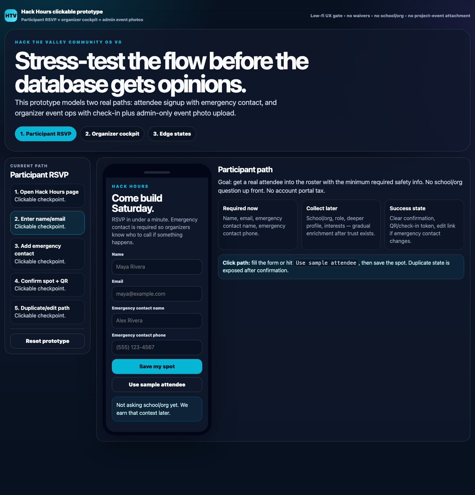
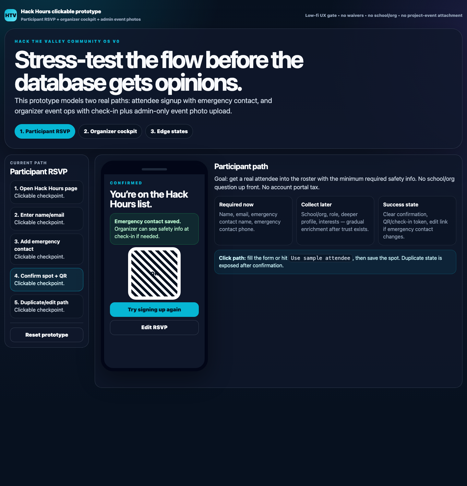
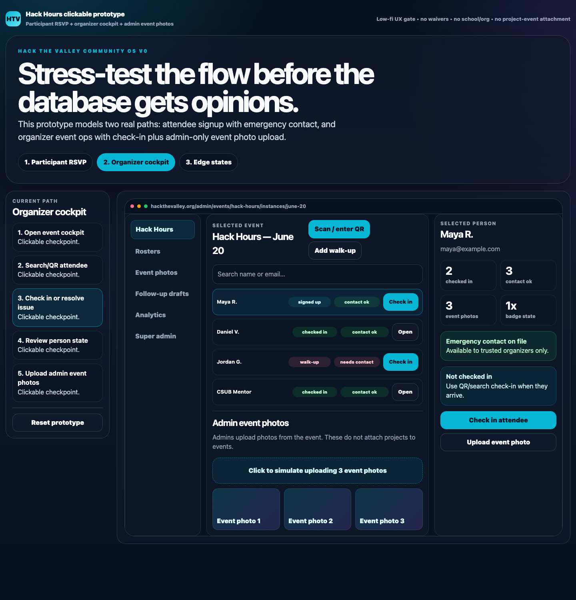
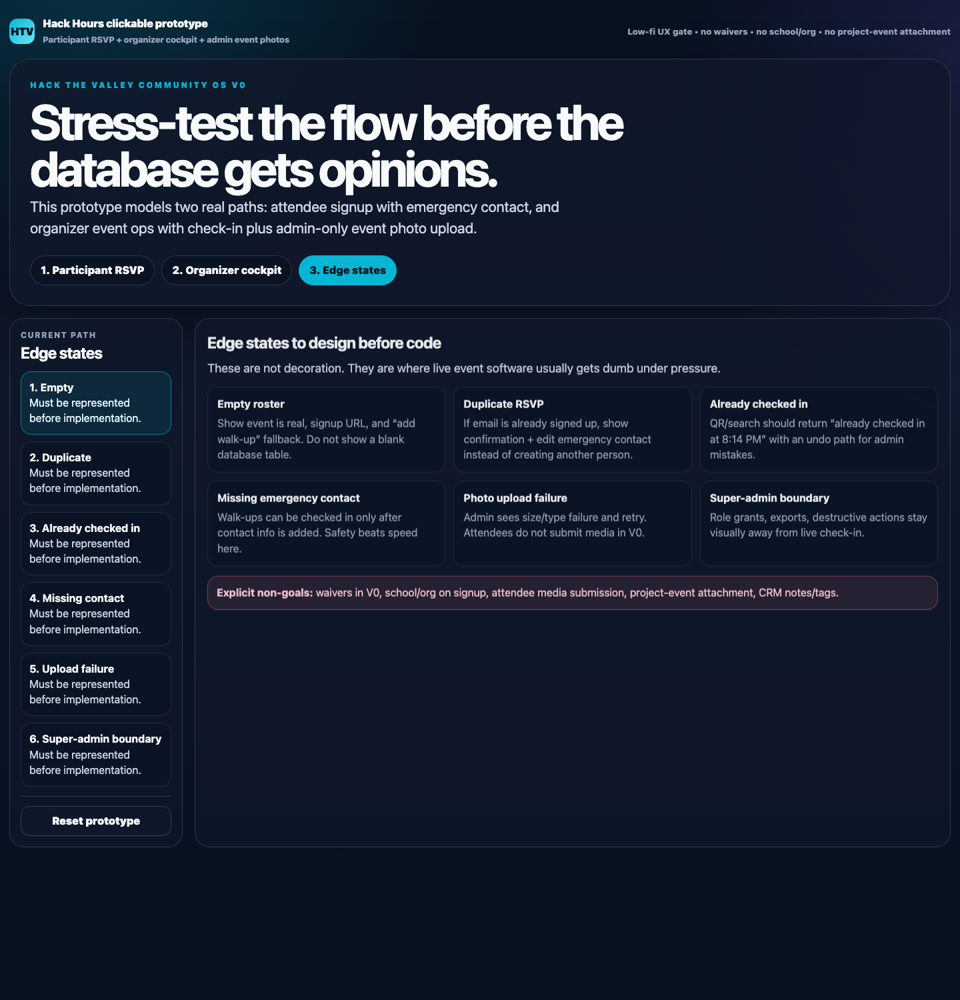

# Hack Hours Event Cockpit V0 Implementation Plan

> **For Hermes:** Use `subagent-driven-development` or a goal loop to implement this plan task-by-task. Treat this file as the approved spec. Do not rewrite it to match implementation drift; put progress/evidence in `docs/plans/2026-06-13-hack-hours-event-cockpit-v0.progress.md`.

**Goal:** Build the first real Hack the Valley community operating-system slice around Hack Hours: attendee RSVP with emergency contact, organizer event cockpit/check-in, and admin-only event photo uploads.

**Architecture:** Extend the existing Cloudflare Worker + D1 + R2 app in the current HTV worktree. Keep the concrete `event_instances` row as the primary operating object. Add only concrete operational state: emergency contacts, check-in/progression state, roles/access seams, and admin-uploaded event photos. Do **not** add CRM notes/tags, waivers, participant uploads, school/org signup fields, or project-event attachment.

**Tech Stack:** Cloudflare Workers/Pages functions style modules, D1 SQLite, R2 via `SUBMISSIONS_MEDIA`, vanilla HTML/CSS/JS in `public/admin.html` and rendered event pages, Node `node:test` suite.

**Primary worktree:** `/Users/skylarpayne/chiefs/palmer-workspace/tmp/hack-the-valley-latest-event-signups`

**Approved UX artifacts:**

- Visual planning board: `https://artifacts.skylarbpayne.com/htv-community-ux-plan`
- Clickable prototype: `https://artifacts.skylarbpayne.com/htv-community-clickable-prototype`
- Prototype source: `/Users/skylarpayne/chiefs/palmer-workspace/artifacts/htv-community-clickable-prototype/index.html`
- Implementation cutlist source: `/Users/skylarpayne/chiefs/palmer-workspace/artifacts/htv-community-clickable-prototype/implementation-cutlist.md`

---

## Non-negotiable product scope

### Build in V0

1. **Participant RSVP with safety info**
   - collect name
   - collect email
   - collect emergency contact name
   - collect emergency contact phone
   - keep email-list opt-in
   - return/enable duplicate-safe confirmation path

2. **Organizer event cockpit**
   - `/admin` defaults to the concrete Hack Hours cockpit/roster, not event settings
   - selected `event_instance` is the primary object
   - roster rows show decision-ready state
   - search/QR-ready check-in is the main action
   - missing emergency contact is visible and blocks normal check-in

3. **Participant state panel**
   - identity
   - signup/check-in state
   - emergency contact present/missing
   - attendance/progression labels
   - event photo/follow-up status where available

4. **Admin-only event photo uploads**
   - organizers/admins upload photos/videos from the event
   - uploads attach to `event_instance_id`, not to projects/submissions
   - store metadata in D1 and binary in R2
   - show count/list in cockpit

5. **Minimal analytics hooks**
   - cockpit summary counts
   - no-shows/check-ins/repeat attendees are computable from existing event-sourced state
   - event photo count is queryable

### Explicit non-goals

- no waivers in V0
- no school/org field on initial signup
- no participant uploads
- no projects attached to events
- no project/submission linkage in event photo model
- no notes/tags/freeform CRM fields
- no payments
- no AI auto-send
- no full role-management UI unless it falls out naturally from existing auth

Existing legacy columns like `users.school`, `signups.school`, `signups.notes`, and the current `waiver_confirmed_at` view column may remain for backward compatibility. Do not surface them in V0 UI and do not expand them.

---

## Current codebase facts to preserve

- `package.json` scripts:
  - `npm test` → `node --test tests/*.test.mjs`
  - `npm run check` → syntax checks selected Worker/function files
  - `npm run dev` → `wrangler dev --port 8788`
- Main Worker router: `worker.js`
- Shared event helpers: `functions/_lib/event-platform.js`
- Current signup API: `functions/api/events/[slug]/signups/index.js`
- Current check-in API: `functions/api/events/[slug]/checkins/index.js`
- Current admin UI: `public/admin.html`
- `npm run check` currently lists files explicitly; any new route module created by this plan must be added to that script, otherwise syntax checks will silently miss it.
- Current rendered event page helper: `renderEventPageHtml()` in `functions/_lib/event-platform.js`
- Current schema/migrations:
  - `schema.sql`
  - `migrations/0004_users_and_user_signups.sql`
  - `migrations/0005_event_participant_events.sql`
  - `migrations/0006_event_instances_and_clean_hack_hours_slug.sql`
  - `migrations/0007_set_hack_hours_photo.sql`
- R2 binding exists as `SUBMISSIONS_MEDIA`; use it for event photos with a separate prefix, do not create new infra unless necessary.

---

## Architecture model

### Primary objects

```text
events
  reusable event definition, e.g. hack-hours

    1-to-many

event_instances
  concrete operating object, e.g. hack-hours / 2026-06-20
  admin cockpit centers here

    1-to-many signups
    1-to-many event_participant_events
    1-to-many emergency_contacts
    1-to-many event_photos
```

### Flow architecture

```text
Participant mobile RSVP
  public event page /events/hack-hours
    POST /api/events/:slug/signups
      normalize signup
      validate emergency contact
      upsert user
      upsert signup against open event_instance
      upsert emergency_contact for user+event_instance
      insert signed_up participant event
      return confirmation payload

Organizer cockpit
  /admin
    GET /api/events/:slug/instances/:instanceId/cockpit
      event instance summary
      roster rows
      emergency contact status
      check-in state
      progression labels
      event photo count

Check-in
  GET /api/events/:slug/checkins?instance_id=...&q=...
  POST /api/events/:slug/checkins
    reject/flag missing emergency contact
    idempotent checked_in participant event

Admin event photos
  POST /api/events/:slug/instances/:instanceId/photos?filename=...&kind=photo
    admin auth required
    validate photo/video
    write body to R2 prefix event-photos/:instanceId/...
    write metadata row to D1

  GET /api/events/:slug/instances/:instanceId/photos
    admin auth required
    list D1 metadata rows
```

### Access architecture

V0 must not get stuck on auth redesign.

- Keep current admin token gate (`requireAdmin(request, env)`) for admin-only routes.
- Add a generic `roles` table as the durable architecture if implementation touches schema; do not build a full role-management UI in this PR.
- Introduce helper naming that does not trap us later:
  - `requireOrganizerAccess(request, env)` can delegate to `requireAdmin` in V0.
  - `requireSuperAdminAccess(request, env)` can delegate to `requireAdmin` in V0 but should only be used around role grants/export/destructive actions.
- Normal organizer work and super-admin controls must remain visually separated in `/admin`.

---

## Data model

Create migration: `migrations/0008_hack_hours_event_cockpit_v0.sql`

Also update `schema.sql` with the final state.

### `emergency_contacts`

Event-scoped first. We may prefill/reuse later, but V0 should make safety explicit per event instance.

```sql
CREATE TABLE IF NOT EXISTS emergency_contacts (
  id TEXT PRIMARY KEY,
  event_instance_id TEXT NOT NULL REFERENCES event_instances(id) ON DELETE CASCADE,
  user_id TEXT NOT NULL REFERENCES users(id) ON DELETE CASCADE,
  signup_id TEXT REFERENCES signups(id) ON DELETE SET NULL,
  name TEXT NOT NULL,
  relationship TEXT,
  phone TEXT NOT NULL,
  source TEXT NOT NULL DEFAULT 'signup',
  created_at TEXT NOT NULL,
  updated_at TEXT NOT NULL,
  UNIQUE(event_instance_id, user_id)
);

CREATE INDEX IF NOT EXISTS idx_emergency_contacts_instance_user
  ON emergency_contacts(event_instance_id, user_id);
```

Rules:

- public signup requires `emergency_contact.name` and `emergency_contact.phone`
- admin walk-up can create/update emergency contact before check-in
- emergency contact is not included in public responses
- emergency contact should not appear in CSV export unless an explicit admin/super-admin export is later designed

### `event_photos`

Name it `event_photos` instead of generic `media_uploads` to prevent accidental project/participant-upload scope creep.

```sql
CREATE TABLE IF NOT EXISTS event_photos (
  id TEXT PRIMARY KEY,
  event_slug TEXT NOT NULL REFERENCES events(slug) ON DELETE CASCADE,
  event_instance_id TEXT NOT NULL REFERENCES event_instances(id) ON DELETE CASCADE,
  uploaded_by TEXT,
  kind TEXT NOT NULL CHECK (kind IN ('photo', 'video')),
  status TEXT NOT NULL DEFAULT 'uploaded' CHECK (status IN ('uploaded', 'approved', 'hidden', 'dismissed')),
  storage_key TEXT NOT NULL UNIQUE,
  public_url TEXT,
  original_filename TEXT,
  content_type TEXT,
  bytes INTEGER,
  caption TEXT,
  created_at TEXT NOT NULL,
  updated_at TEXT NOT NULL
);

CREATE INDEX IF NOT EXISTS idx_event_photos_instance_created_at
  ON event_photos(event_instance_id, created_at DESC);

CREATE INDEX IF NOT EXISTS idx_event_photos_status
  ON event_photos(status, created_at DESC);
```

Rules:

- no `project_id`
- no `submission_id`
- no `participant_user_id`
- no participant upload surface
- R2 keys use `event-photos/${eventInstanceId}/${generatedId}-${safeFilename}`

### `roles`

Architecture table for future role-aware access. Safe to add now if touching schema; UI can wait.

```sql
CREATE TABLE IF NOT EXISTS roles (
  id TEXT PRIMARY KEY,
  user_id TEXT NOT NULL REFERENCES users(id) ON DELETE CASCADE,
  role TEXT NOT NULL,
  scope_type TEXT NOT NULL DEFAULT 'global' CHECK (scope_type IN ('global', 'event', 'event_instance', 'organization')),
  scope_id TEXT NOT NULL DEFAULT '*',
  granted_by_user_id TEXT REFERENCES users(id) ON DELETE SET NULL,
  created_at TEXT NOT NULL,
  revoked_at TEXT,
  UNIQUE(user_id, role, scope_type, scope_id)
  -- Use scope_id='*' for global scope. Do not store NULL here; SQLite UNIQUE allows duplicate NULLs.
);

CREATE INDEX IF NOT EXISTS idx_roles_user_active
  ON roles(user_id, role, scope_type, scope_id)
  WHERE revoked_at IS NULL;
```

Initial role values:

- `admin`
- `super_admin`
- `organizer`
- `mentor`
- `sponsor`
- `judge`
- `parent_guardian` later, not surfaced in V0

### Derived views/helpers

Do not overbuild analytics. Add query helpers instead of dashboards.

Recommended helper shape in `functions/_lib/event-platform.js`:

```js
export async function getEventCockpit(db, eventSlug, eventInstanceId) { /* returns summary + roster */ }
export async function upsertEmergencyContact(db, { eventInstanceId, userId, signupId, contact, source }) { /* ... */ }
export async function getEmergencyContactStatus(db, eventInstanceId, userId) { /* boolean/details for admin only */ }
export async function listEventPhotos(db, eventSlug, eventInstanceId) { /* ... */ }
export async function createEventPhotoRecord(db, input) { /* ... */ }
```

Cockpit roster rows should include:

```js
{
  user_id,
  signup_id,
  event_instance_id,
  name,
  email,
  is_signed_up,
  signed_up_at,
  checked_in_at,
  emergency_contact_present,
  attendance_count,
  progression_labels: ['first-time'] | ['repeat'] | ['3x attendee'],
}
```

### Progression/analytics definitions

Keep these definitions stable so separate goal-loop runs do not invent different meanings:

- `attendance_count`: count distinct event instances where the user has a `checked_in` event in `event_participant_events`. Include the current event if already checked in. Do **not** count signups/no-shows.
- `repeat_attendee_count`: count roster users whose `attendance_count >= 2` after including current checked-in state.
- `progression_labels`:
  - `first-time` when `attendance_count === 0` before check-in or `attendance_count === 1` after first check-in
  - `repeat` when `attendance_count >= 2`
  - `3x attendee` when `attendance_count >= 3`
  - `mentor` or other role labels only when derived from `roles`, not from freeform tags
- `missing_emergency_contact_count`: roster rows for the selected instance where no `emergency_contacts` row exists for `(event_instance_id, user_id)` or required name/phone is blank.

### Event photo validation rules

- Allowed `kind`: `photo`, `video`.
- Allowed photo MIME types: `image/jpeg`, `image/png`, `image/webp`, `image/heic`, `image/heif`.
- Allowed video MIME types: `video/mp4`, `video/quicktime`, `video/webm`.
- `kind=photo` must use an allowed image MIME type. `kind=video` must use an allowed video MIME type.
- Max size comes from `MAX_UPLOAD_MB` env var, defaulting to the existing upload helper behavior if reused.
- Sanitize filenames with the existing upload safe-filename pattern; reject/strip path traversal (`../`, `/`, `\`).
- Failure response shape should be JSON: `{ error: 'Upload rejected.', errors: [...] }` with 400 for validation and 503 for missing R2 binding.

---

## UI/UX mocks

The approved clickable artifact is the UI source of truth:

`https://artifacts.skylarbpayne.com/htv-community-clickable-prototype`

The plan includes generated visual mocks under `docs/artifacts/hack-hours-event-cockpit-v0/`. A goal-loop implementer should keep these images open while working; the ASCII/prose notes are secondary.

### Mock 1: Participant RSVP form



Required implementation details:

- mobile-first signup surface
- fields: name, email, emergency contact name, emergency contact phone
- no school/org field
- no waiver language
- no participant upload CTA
- primary CTA: “Save my spot”
- helper copy should explain emergency contact is for safety, not profile enrichment

### Mock 2: Participant confirmation state



Required implementation details:

- confirmation clearly says the attendee is on the list
- emergency contact saved state is explicit
- QR/camera scanning is token-ready only in V0. The real shipped check-in path is admin search/manual check-in unless QR generation is already trivial in the existing stack
- duplicate signup state should not create another person; it should show confirmation/update-contact behavior

### Mock 3: Organizer event cockpit



Required implementation details:

- `/admin` opens around the concrete event cockpit/roster, not settings
- roster/check-in is the front door
- search/QR-ready action is visually primary
- rows show check-in state and emergency-contact state
- missing emergency contact is visible and resolvable before check-in
- event photo upload is admin-only and labeled as event photos
- event photo upload does not mention projects/submissions
- event settings and super-admin controls are secondary/separated

### Mock 4: Edge states



Required before merge:

- empty roster
- duplicate RSVP
- missing emergency contact
- already checked in
- upload size/type failure
- non-admin blocked from admin surface

---

## Local setup prerequisites for goal-loop runs

Before browser acceptance or local API testing, the implementer should establish a deterministic local environment. Do not use remote production data for this.

1. From the worktree, run `npm install` only if `node_modules` is missing.
2. Run `npm test` and `npm run check` to capture baseline.
3. Apply local migrations only after confirming local D1 state:
   - `wrangler d1 migrations apply HTV_DB --local`
4. Seed/verify an open Hack Hours event and instance in local D1. If no seed helper exists, create a tiny documented local-only seed script or use existing admin/API paths; record exact commands in the progress file.
5. Set a local admin token for browser/API smoke. Use a throwaway token, e.g. `HTV_ADMIN_TOKEN=local-test-token`, and pass it as `X-Admin-Token: local-test-token`.
6. If local D1/R2 cannot be initialized, stop the browser acceptance slice and record a blocker rather than faking output.

Remote migrations, real Cloudflare vars, or production R2/D1 changes require explicit Skylar approval.

---

## Vertical slices

Each slice should end with tests passing, browser smoke evidence, and a short progress note in `docs/plans/2026-06-13-hack-hours-event-cockpit-v0.progress.md`.

### Slice 0: Baseline and migration runway

**Objective:** Verify the worktree and add the schema runway without changing user-facing behavior.

**Files:**

- Create: `migrations/0008_hack_hours_event_cockpit_v0.sql`
- Modify: `schema.sql`
- Modify: `package.json`
- Modify: `tests/event-platform.test.mjs`

**Tasks:**

1. Run baseline checks.
   - Command: `npm test`
   - Command: `npm run check`
   - Expected: both pass before changes; if not, record blocker in progress file.
2. Add schema tests asserting `emergency_contacts`, `event_photos`, and `roles` exist in `schema.sql` and migration.
3. Run `npm test`; expected fail because schema is not added yet.
4. Add migration and update `schema.sql` with exact DDL above.
5. Update `package.json` `check` script only for files that exist at the end of this slice. At minimum, include existing `functions/api/events/[slug]/checkins/index.js` if it is missing. Do **not** add future cockpit/photos route files to `check` until the slices that create those files; otherwise `npm run check` will fail on nonexistent paths. Later slices must add their new route modules immediately after creating them.
6. Run `npm test`; expected pass.
7. Run `npm run check`; expected pass.
8. Progress note with commands/output summary.

**Acceptance:**

- Schema and migration include new tables.
- No waiver table/field is added.
- `event_photos` has no project/submission/person participant linkage.

### Slice 1: Emergency contact signup contract

**Objective:** Public signup requires emergency contact and stores it against the concrete event instance.

**Files:**

- Modify: `functions/_lib/event-platform.js`
- Modify: `functions/api/events/[slug]/signups/index.js` only if response shape changes are needed
- Modify: `tests/event-platform.test.mjs`

**Tasks:**

1. Add tests for `normalizeSignupInput()` requiring emergency contact name/phone.
2. Add tests that signup input ignores/does not require school/org.
3. Add tests that `upsertSignup()` calls an emergency-contact insert/update helper after signup/user is known.
4. Implement `normalizeEmergencyContactInput(input)`.
5. Implement `upsertEmergencyContact(db, { eventInstanceId, userId, signupId, contact, source })`.
6. Call `upsertEmergencyContact()` inside `upsertSignup()` after `savedSignup` is selected.
7. Include `emergency_contact_present: true` in the signup API response; do not return contact phone publicly.
8. Run `npm test` and `npm run check`.

**Acceptance:**

- Missing emergency contact name or phone returns 400.
- Valid signup stores emergency contact.
- Duplicate signup updates existing signup/contact rather than creating duplicate person.
- School/org is not shown or required.

### Slice 2: Public RSVP UI

**Objective:** Participant-facing signup form matches the approved mobile mock.

**Files:**

- Modify: `functions/_lib/event-platform.js` (`renderEventPageHtml`)
- Modify: `public/events/index.html` if client-rendered event detail form also exists there
- Modify: `tests/event-platform.test.mjs`

**Tasks:**

1. Add static tests that rendered event page includes `name="emergency_contact_name"` and `name="emergency_contact_phone"`.
2. Add static tests that rendered event page does not include `name="school"`, `School / org`, `name="notes"`, or waiver language.
3. Update `renderEventPageHtml()` form fields and submit body mapping.
4. Update success copy to mention emergency contact saved and QR/check-in token placeholder if token is available.
5. Ensure duplicate/error copy is human-readable.
6. Run `npm test` and `npm run check`.
7. Browser-smoke `/events/hack-hours` locally with `npm run dev` if environment is ready; capture screenshot or note blocker.

**Acceptance:**

- Mobile form is name/email/emergency contact only.
- CTA does not overlap fields.
- Error state identifies missing emergency contact clearly.

### Slice 3: Cockpit summary API

**Objective:** Provide one admin API for the event cockpit so UI does not reconstruct state from many ad hoc calls.

**Files:**

- Create: `functions/api/events/[slug]/instances/[instanceId]/cockpit/index.js`
- Modify: `functions/_lib/event-platform.js`
- Modify: `worker.js`
- Modify: `tests/event-platform.test.mjs`

**Route:**

`GET /api/events/:slug/instances/:instanceId/cockpit`

**Response shape:**

```json
{
  "event": { "slug": "hack-hours", "title": "Hack Hours" },
  "instance": { "id": "inst_hack_hours_20260620", "instance_key": "2026-06-20", "starts_at": "..." },
  "summary": {
    "signed_up_count": 22,
    "checked_in_count": 15,
    "missing_emergency_contact_count": 1,
    "event_photo_count": 3,
    "repeat_attendee_count": 5
  },
  "roster": [
    {
      "user_id": "usr_...",
      "signup_id": "sgn_...",
      "name": "Maya R.",
      "email": "maya@example.com",
      "signed_up_at": "...",
      "checked_in_at": null,
      "emergency_contact_present": true,
      "attendance_count": 1,
      "progression_labels": ["first-time"]
    }
  ],
  "photos": { "count": 3, "recent": [] }
}
```

**Tasks:**

1. Add tests for worker route matching `/api/events/hack-hours/instances/inst_123/cockpit`.
2. Add tests for `getEventCockpit()` SQL joining signups/users/current state/emergency contacts.
3. Implement `getEventCockpit(db, eventSlug, eventInstanceId)`. It must verify the instance belongs to the provided slug using `getEventInstance(db, eventSlug, eventInstanceId)` or equivalent and return 404 if not.
4. Add tests for slug/instance mismatch returning 404.
5. Implement route module with `requireAdmin()`.
6. Import route in `worker.js` and add regex route before generic event route.
7. Ensure `package.json` `check` includes the new route file.
8. Run `npm test` and `npm run check`.

**Acceptance:**

- Admin token required.
- Response has summary + roster + photo count.
- No emergency contact phone is exposed unless explicitly needed by organizer detail; if exposed, only on admin route.
- No school/org/notes are included in roster rows.

### Slice 4: Emergency-contact-aware check-in

**Objective:** Check-in flow blocks missing emergency contact and returns idempotent already-checked-in state.

**Files:**

- Modify: `functions/_lib/event-platform.js`
- Modify: `functions/api/events/[slug]/checkins/index.js`
- Modify: `tests/event-platform.test.mjs`

**Tasks:**

1. Add tests that check-in rejects/blocks a user with no emergency contact for the instance.
2. Add tests that already checked-in response is explicit and idempotent.
3. Add admin walk-up/contact payload support:
   - `emergency_contact_name`
   - `emergency_contact_phone`
   - optional `emergency_contact_relationship`
4. In `checkInAttendee()`, before inserting `checked_in`, check emergency contact status.
5. If contact payload is present, upsert contact first.
6. If contact missing, throw 409 with `code: "missing_emergency_contact"` or JSON error equivalent.
7. Return `already_checked_in: true` when duplicate insert hits existing current state.
8. Run `npm test` and `npm run check`.

**Acceptance:**

- Normal check-in cannot silently proceed without contact.
- Walk-up can add contact and check in.
- Already checked-in state is not treated as a scary error.

### Slice 5: Admin event photo API

**Objective:** Admins can upload/list event photos attached only to event instances.

**Files:**

- Create: `functions/api/events/[slug]/instances/[instanceId]/photos/index.js`
- Modify: `functions/_lib/event-platform.js`
- Modify: `worker.js`
- Modify: `tests/event-platform.test.mjs`

**Routes:**

- `GET /api/events/:slug/instances/:instanceId/photos`
- `POST /api/events/:slug/instances/:instanceId/photos?filename=photo.jpg&kind=photo`

**Implementation notes:**

- Reuse validation concepts from `functions/api/upload.js` / `functions/_shared/submissions.js`, but do not reuse key builder that generates `submissions/` paths.
- R2 key prefix: `event-photos/${instanceId}/${photoId}-${safeFilename}`
- Use `env.SUBMISSIONS_MEDIA` for now unless existing deployment requires a new bucket binding.
- Admin auth required.

**Tasks:**

1. Add route tests in `worker.js` path matching.
2. Add tests that photos route rejects slug/instance mismatch with 404.
3. Add tests that event photo POST rejects missing R2 binding with 503.
4. Add tests that event photo POST rejects non-photo/video content type.
5. Add tests for `kind`/MIME mismatch, path traversal filenames, and oversize behavior.
6. Add tests that event photo metadata insert SQL has `event_instance_id`, `storage_key`, and no `submission_id`/`project_id`.
7. Implement `createEventPhotoRecord()` and `listEventPhotos()` helpers.
8. Implement route module.
9. Ensure `package.json` `check` includes the new route file.
10. Run `npm test` and `npm run check`.

**Acceptance:**

- Uploaded object lands under `event-photos/` prefix.
- D1 metadata row references event instance only.
- List endpoint returns uploaded photos for selected instance.
- No participant-facing upload is introduced.

### Slice 6: Admin cockpit UI

**Objective:** Make `/admin` open around the Hack Hours event cockpit instead of treating settings/forms as the product center.

**Files:**

- Modify: `public/admin.html`
- Modify: `tests/event-platform.test.mjs`

**Tasks:**

1. Add static tests that admin page contains:
   - `id="event-cockpit"`
   - `id="cockpit-roster"`
   - `id="cockpit-summary"`
   - `id="event-photo-upload"`
   - `function loadEventCockpit`
   - fetch to `/api/events/${slug}/instances/${instanceId}/cockpit`
2. Add static tests that event settings/create form is not the first primary section.
3. Add static tests that admin page does not display `School`, `Notes`, `Waiver`, `Project upload`, or participant-upload copy in cockpit.
4. Add static tests that the cockpit/person panel/manual walk-up path contains emergency contact fields/actions for organizers to resolve missing contact:
   - `name="emergency_contact_name"` or stable equivalent
   - `name="emergency_contact_phone"` or stable equivalent
   - copy/action for `Add emergency contact` or `Update emergency contact`
5. Update admin layout:
   - cockpit as first/main section
   - existing event creation/editing remains available lower or secondary
   - check-in search remains visible and fast
   - person state drawer/panel shows emergency contact present/missing
   - missing-contact rows expose add/update contact fields before check-in
   - manual walk-up flow collects emergency contact before check-in
   - event photo upload surface appears inside cockpit
6. Wire cockpit API into UI.
7. Wire check-in response states:
   - success
   - missing emergency contact
   - already checked in
8. Wire photo upload/list API.
9. Run `npm test` and `npm run check`.

**Acceptance:**

- Organizer can run an event from one screen.
- Missing emergency contact is obvious.
- Admin photo upload says event photos, not project media.
- Super-admin controls/settings are visually secondary.

### Slice 7: UX browser acceptance

**Objective:** Prove the built UI matches the approved prototype in a browser.

**Files:**

- Create/update: `docs/plans/2026-06-13-hack-hours-event-cockpit-v0.progress.md`
- Optional screenshots: `docs/artifacts/hack-hours-event-cockpit-v0/`

**Tasks:**

1. Start local server:
   - Command: `npm run dev`
   - Expected: Wrangler dev on port `8788`.
2. Browser-test participant signup page:
   - open `/events/hack-hours`
   - verify name/email/emergency-contact fields
   - verify no school/org field
   - submit missing contact; expect clear error
   - submit valid contact; expect confirmation
3. Browser-test admin cockpit:
   - open `/admin`
   - login with test/admin token if required
   - verify cockpit/roster is the front door
   - search attendee
   - check in attendee with contact
   - attempt missing-contact check-in; expect blocker
   - upload event photo with valid type
   - try invalid type/oversize if easy; expect failure state
4. Save screenshots or write exact observations to progress file.
5. Run final checks:
   - `npm test`
   - `npm run check`

**Acceptance:**

- Screens match approved prototype intent.
- No console errors in tested paths.
- Test suite passes.
- Progress file contains evidence.

---

## Test strategy

Use current `node:test` style. Prefer focused tests in `tests/event-platform.test.mjs` unless it becomes too large; if it does, create `tests/hack-hours-cockpit.test.mjs` and ensure `npm test` picks it up.

Required tests:

- `package.json` `check` includes every new/modified Worker route module
- schema has `emergency_contacts`, `event_photos`, `roles` with non-null role `scope_id` sentinel behavior
- emergency contact required on signup
- emergency contact stored for signup/user/instance
- duplicate signup updates contact instead of creating duplicate user/signup
- rendered event signup form includes emergency contact fields
- rendered event signup form excludes school/org, notes, waivers
- `requireOrganizerAccess()` and `requireSuperAdminAccess()` helpers exist and delegate safely in V0
- cockpit route is matched by Worker
- cockpit route requires admin
- cockpit helper returns emergency-contact status and photo count
- check-in blocks missing emergency contact
- check-in is idempotent for already checked-in attendee
- cockpit/photos routes reject slug-instance mismatch
- event photo upload writes R2 key under `event-photos/`
- event photo metadata has no project/submission linkage
- admin UI static tests for cockpit IDs and forbidden copy

---

## Verification commands

From `/Users/skylarpayne/chiefs/palmer-workspace/tmp/hack-the-valley-latest-event-signups`:

```bash
npm test
npm run check
npm run dev
```

If applying migrations locally/remotely during implementation, verify exact environment first. Do not run remote migrations without Skylar approval.

Potential local migration command, only after confirming D1 target:

```bash
wrangler d1 migrations apply HTV_DB --local
```

Remote migration requires explicit approval:

```bash
wrangler d1 migrations apply HTV_DB --remote
```

---

## Anti-patterns / loopholes

- Do not edit this approved plan to make drift look approved.
- Do not add waiver UI/schema in V0.
- Do not add school/org to signup.
- Do not add participant uploads.
- Do not attach projects/submissions to event photos.
- Do not make `/admin` a settings table first and call it a cockpit.
- Do not expose emergency contact info publicly or in ordinary CSV exports.
- Do not replace browser UX acceptance with unit tests only.
- Do not create new R2/D1 bindings or remote infra changes without approval.
- Do not auto-send follow-ups.
- Do not use fake success output; preserve command evidence in the progress file.

---

## Suggested branch / PR

Branch:

```bash
git checkout -b feat/hack-hours-event-cockpit-v0
```

PR title:

```text
feat: add Hack Hours event cockpit and progression loop
```

PR must include:

- migration summary
- screenshots or walkthrough artifact
- test output summary
- explicit statement that waivers/school-org/participant uploads/project-event attachment remain out of scope
