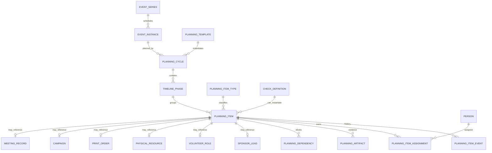
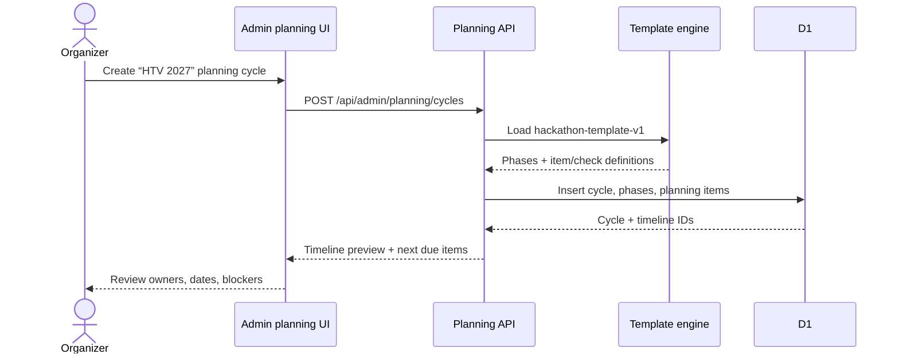
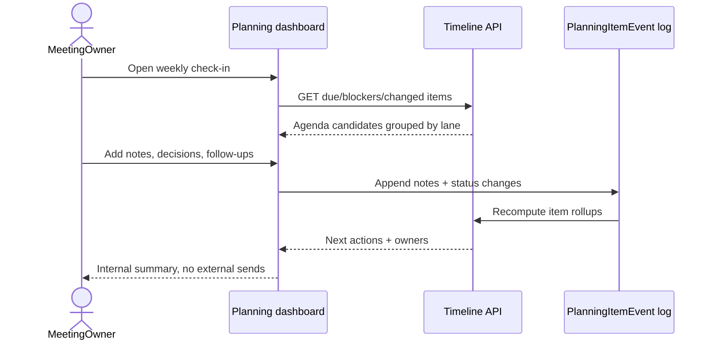
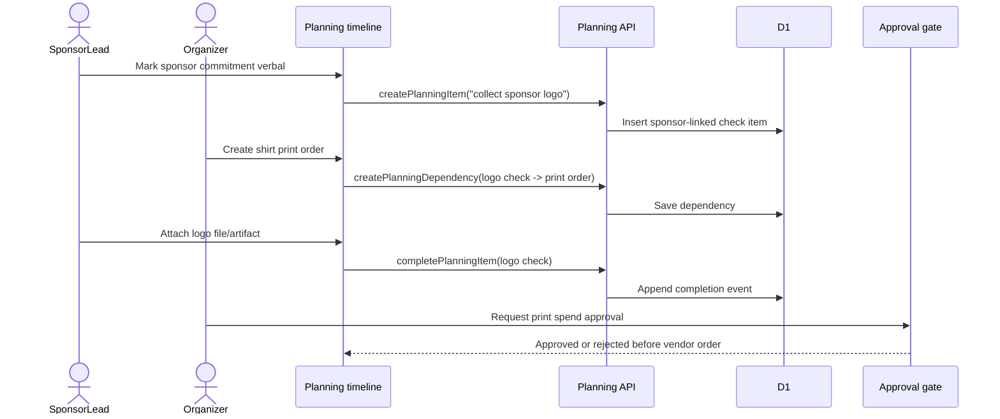
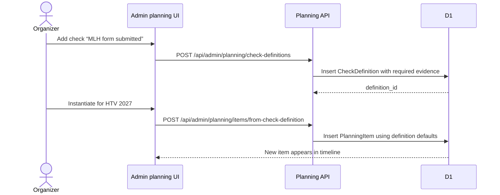
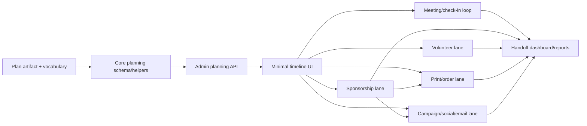

# HTV 2027 Planning / Management System Domain Plan

> **For Hermes:** Use `subagent-driven-development` only after Skylar approves this plan. Do not start implementation from this plan automatically.

**GitHub issue:** [#86 — Create a complete hackathon planning / management system for Hack the Valley 2027](https://github.com/skylarbpayne/hack-the-valley/issues/86)

**Visual artifact:** [`docs/visuals/issue-86-htv-2027-planning-model.html`](../visuals/issue-86-htv-2027-planning-model.html)

**Implementation sequence:** Use the vertical-slice plan in [`docs/plans/2026-06-24-htv-2027-vertical-slice-implementation-plan.md`](./2026-06-24-htv-2027-vertical-slice-implementation-plan.md). The domain model below is the vocabulary; the vertical-slice plan is the build order.

**Goal:** Build a flexible HTV 2027 planning system where the planning timeline is the spine and sponsorship, volunteers, inventory, print orders, meetings, social posts, and email broadcasts attach to typed timeline items.

**Architecture:** Preserve the existing HTV event/community model (`EventSeries`, `EventInstance`, `Person`, `Participation`, `Project`, `Campaign`, `PhysicalResource`) and add a planning spine around it: `PlanningCycle → TimelinePhase → PlanningItem`. New checks/items should be configured through `PlanningItemType` / `CheckDefinition` / templates and stored as typed records with `metadata_json`, not hard-coded as one-off columns every time CSUB adds a new checklist item.

**Tech stack:** Cloudflare Worker + D1 + existing session-admin surface, plain JS domain helpers under `functions/_lib/domain/`, Valibot for boundary validation, Node test runner, static admin HTML.

---

## Current repo facts verified from `origin/main`

- Admin role/session auth exists and the admin surface lives at `public/admin.html`.
- Existing domain docs live at `docs/domain-model.md`.
- Existing event primitives:
  - `events` = reusable public event/program metadata.
  - `event_instances` = concrete occurrence/date/location.
  - `signups`, `event_participant_events`, `emergency_contacts` = participation/readiness facts.
- Existing adjacent domains already available:
  - helper/volunteer/sponsor interest: `helper_interests`.
  - inventory/assets: `physical_resources`, `physical_resource_checkouts`.
  - projects/showcase: `projects`, `event_project_submissions`, `event_project_awards`.
  - outbound comms are partial and approval-sensitive: mailing-list sync, follow-up packet, blog broadcast path.
- `functions/api/admin/workflows.js` currently exposes non-editorial admin operations, but explicitly excludes editorial/outbound messaging from that surface.

## Product position

This should **not** become a generic CRM, Asana clone, or event-management SaaS cosplay. The correct product is:

> A handoff-safe operating system for one annual hackathon cycle, where the club can always answer: what needs to happen next, who owns it, what is blocked, what evidence exists, and what external action needs approval?

The timeline is the main object. Everything else hangs off it.

---

## Domain model



### Core entities

| Entity | Meaning | Storage strategy |
| --- | --- | --- |
| `PlanningCycle` | One planning workspace for HTV 2027, linked to the target `EventInstance`. | New table. Small, explicit. |
| `TimelinePhase` | Ordered bucket like `T-12 months`, `Sponsor close`, `Event week`, `Post-event`. | New table. Supports date offsets and manual dates. |
| `PlanningItem` | The universal object for milestone/task/check/meeting/follow-up/order/post/reminder. | New table with common fields plus `metadata_json`. |
| `PlanningItemType` | Type registry defining behavior and UI labels. | Seeded table or config-backed table. This is how we add new item/check types. |
| `CheckDefinition` | Reusable check template with default due offset, required evidence, blocking behavior. | New table. Can instantiate many `PlanningItem`s. |
| `PlanningItemEvent` | Append-only item history: created, assigned, blocked, completed, commented, reopened. | New table. Keeps handoff/accountability intact. |
| `PlanningArtifact` | Link/file/note attached to an item: deck, contract, meeting notes, quote, print proof. | New table. R2 support later if needed. |
| `PlanningDependency` | Item A blocks Item B. | New table. Needed for sponsor logo → print order → publish program flow. |

### Domain-specific lanes attach to `PlanningItem`

| Lane | First-class later? | V0 relationship |
| --- | --- | --- |
| Sponsorship management | Yes | `SponsorLead` / `SponsorCommitment` links to items like outreach, follow-up, logo received, invoice paid. |
| Volunteer management | Yes | `VolunteerRole` / `VolunteerShift` links to recruiting and coverage checks. |
| Physical assets | Already partly exists | `physical_resources` and checkouts link to logistics/timeline items. |
| Print orders | Yes | `PrintOrder` links to sponsor assets, quantities, vendor quotes, approval gates. |
| Social media | Yes, but approval-gated | `Campaign` / `SocialPostDraft` links to publish-ready items. |
| Email broadcasts | Yes, approval-gated | `Campaign` / `MessageDraft` / `MessageDelivery` links to planning items. |
| Meetings/check-ins | Yes | `MeetingRecord` attaches agenda, notes, and generated follow-up items. |

---

## Flexible timeline item design

The essential choice: **do not make every new checklist item a schema migration.**

Use this shape:

```js
PlanningItem = {
  id,
  cycle_id,
  phase_id,
  item_type_id,          // milestone | task | check | meeting | followup | reminder | order | social_post | email_broadcast
  check_definition_id,   // nullable: source reusable check/template
  title,
  description,
  status,                // todo | in_progress | blocked | waiting_approval | done | cancelled
  priority,
  owner_user_id,
  owner_label,           // for CSUB committee/team ownership before every person has an account
  starts_at,
  due_at,
  completed_at,
  blocking_severity,     // none | soft | hard
  approval_required,
  approval_state,        // none | requested | approved | rejected
  related_domain,        // sponsor | volunteer | inventory | print | social | email | meeting | event
  related_id,            // optional link to sponsor/print/campaign/etc.
  metadata_json,
  created_at,
  updated_at
}
```

Examples of `metadata_json`:

```json
{
  "sponsor_tier": "gold",
  "required_evidence": ["logo_file", "invoice_status"],
  "reminder_cadence": "weekly",
  "external_deadline": "2027-03-01"
}
```

```json
{
  "print_vendor": "TBD",
  "quantity": 120,
  "sizes_source": "participant_roster",
  "blocked_by": ["sponsor_logo_received", "shirt_sizes_locked"]
}
```

That gives us flexibility without making the database a junk drawer.

---

## Available operations

### Cycle/template operations

| Operation | Actor | Notes |
| --- | --- | --- |
| `createPlanningCycle` | Admin | Creates HTV 2027 workspace linked to target event instance. |
| `instantiatePlanningTemplate` | Admin | Creates phases/items/checks from reusable template. No external side effects. |
| `shiftCycleDates` | Admin | Recomputes relative due dates when the hackathon target date moves. Requires preview first. |
| `archivePlanningCycle` | Super admin | Closes old planning cycle after handoff. |

### Timeline/check operations

| Operation | Actor | Notes |
| --- | --- | --- |
| `listPlanningTimeline` | Admin/organizer | Filter by phase, owner, status, domain, due date. |
| `createPlanningItem` | Admin/organizer | Adds one-off milestone/task/check/meeting. |
| `createCheckDefinition` | Admin | Adds reusable checks like “sponsor logo received”. |
| `instantiateCheckDefinition` | Admin | Creates checklist items from a definition for one sponsor/order/phase/cycle. |
| `assignPlanningItem` | Admin/owner | Assign user or committee/team label. |
| `updatePlanningItemStatus` | Admin/owner | Appends `PlanningItemEvent`; does not silently rewrite history. |
| `attachPlanningArtifact` | Admin/owner | Links notes, files, docs, quotes, proof, screenshots. |
| `createPlanningDependency` | Admin/owner | Declares that one item blocks another, e.g. sponsor logo blocks print proof approval. |
| `removePlanningDependency` | Admin/owner | Removes a dependency with an event-log reason; does not delete prior history. |
| `listBlockedItems` | Admin/organizer | Shows items blocked by dependency, approval, missing evidence, or overdue prerequisites. |
| `listBlockingItems` | Admin/organizer | Shows upstream blockers grouped by owner/domain lane. |
| `recomputeReadyState` | System | Reprojects ready/blocked state after completion/reopen/dependency changes. |
| `requestApproval` | Admin/owner | Moves item to `waiting_approval`. |
| `approvePlanningAction` | Skylar/super admin or designated approver | Needed before external sends, spending, public publishing, contract changes. |

### Reminder operations

| Operation | Actor | Notes |
| --- | --- | --- |
| `createReminder` | Admin/owner | Creates a reminder tied to a planning item or follow-up. |
| `scheduleReminder` | Admin/owner | Sets one-time or repeating reminder cadence. Internal notification only in V0. |
| `snoozeReminder` | Owner | Appends snooze event and recalculates next reminder time. |
| `dismissReminder` | Owner | Marks reminder done/cancelled with a reason. |
| `listDueReminders` | Admin/organizer | Feeds weekly check-in and dashboard “needs attention” views. |

V0 reminders are internal/admin notifications. They must not send external email/SMS/social messages unless a later approved campaign/delivery operation explicitly does that.

### Meeting/check-in operations

| Operation | Actor | Notes |
| --- | --- | --- |
| `createMeetingRecord` | Organizer | Creates scheduled planning meeting/check-in. |
| `generateMeetingAgenda` | System | Pulls blocked/due/changed items. |
| `attachMeetingNotes` | Organizer | Saves notes as artifact and extracts follow-ups. |
| `createFollowupItems` | Organizer | Turns meeting decisions into typed items with owners/dates. |

### Domain lane operations

| Lane | Operations |
| --- | --- |
| Sponsorship | create sponsor lead, log touchpoint, set tier/status, attach contract/logo/invoice evidence, create print/order blockers. |
| Volunteers | define roles, recruit helpers, assign shifts, mark coverage gaps, attach training docs. |
| Physical assets | inventory item, checkout/return, maintenance/lost state, attach photos, link to event logistics items. |
| Print orders | create print order, request quote, approve spend, lock quantities, upload proof, mark delivered. |
| Social | create draft post, request approval, publish externally only after approval, log permalink/result. |
| Email | create campaign draft, preview audience, request approval, send/schedule only after approval, log deliveries. |

---

## User interaction sequences

### 1. Organizer creates HTV 2027 planning cycle



### 2. Weekly planning check-in creates follow-ups



### 3. Sponsor logo blocks print order until evidence exists



### 4. Add a new check type without a migration



---

## Initial decomposition sketch (superseded for build order)

This section is the first domain-oriented decomposition. It remains useful for scope boundaries, but **do not build this as horizontal layer PRs**. Use the vertical-slice implementation plan for the actual issue/PR sequence so every phase ships a usable `/admin` workflow.

### PR 1 — Planning vocabulary + visual plan artifact

**Goal:** Land the approved vocabulary and decomposition before code.

**Files:**
- Create: `docs/plans/2026-06-24-htv-2027-planning-system.md`
- Create: `docs/visuals/issue-86-htv-2027-planning-model.html`
- Modify: `docs/domain-model.md` only if Skylar approves folding `PlanningCycle` into canonical vocabulary now.

**Acceptance criteria:**
- The visual artifact explains relationships, available operations, and user sequences.
- No production code, migrations, sends, deploys, or public behavior changes.

### PR 2 — Core planning schema + domain helpers

**Goal:** Add the storage spine and JS domain helpers without exposing UI yet.

**Files:**
- Create migration: `migrations/0025_planning_cycle_spine.sql`
- Modify: `schema.sql`
- Create: `functions/_lib/domain/planning.js`
- Create tests: `tests/domain-planning.test.mjs`

**Schema sketch:**

```sql
CREATE TABLE IF NOT EXISTS planning_cycles (...);
CREATE TABLE IF NOT EXISTS timeline_phases (...);
CREATE TABLE IF NOT EXISTS planning_item_types (...);
CREATE TABLE IF NOT EXISTS check_definitions (...);
CREATE TABLE IF NOT EXISTS planning_items (...);
CREATE TABLE IF NOT EXISTS planning_item_events (...);
CREATE TABLE IF NOT EXISTS planning_artifacts (...);
CREATE TABLE IF NOT EXISTS planning_dependencies (...);
```

**Acceptance criteria:**
- Tests prove item type/check definitions can create typed items.
- Status changes append events instead of overwriting history silently.
- Reminder schedule/snooze/dismiss appends events and feeds due-reminder queries.
- Dependency/blocker updates reproject downstream ready/blocked state.
- Adding a new check definition does not require a new migration.

### PR 3 — Admin planning API

**Goal:** Expose session-admin APIs for cycles, timeline listing, items, events, artifacts, dependencies.

**Files:**
- Create: `functions/api/admin/planning/cycles/index.js`
- Create: `functions/api/admin/planning/items/index.js`
- Create: `functions/api/admin/planning/items/[id].js`
- Create: `functions/api/admin/planning/check-definitions/index.js`
- Create: `functions/api/admin/planning/meetings/index.js`
- Modify: `worker.js`
- Add tests: `tests/admin-planning-api.test.mjs`

**Acceptance criteria:**
- Bootstrap-token access rejected; signed-in admin session required.
- External action fields (`approval_required`) cannot be self-approved by request body.
- APIs return safe, deterministic timeline/item payloads.

### PR 4 — Minimal admin timeline UI

**Goal:** Add a usable planning dashboard to `public/admin.html` without turning it into a giant form wall.

**Files:**
- Modify: `public/admin.html`
- Add tests: `tests/admin-planning-ui.test.mjs`

**UI shape:**
- Planning cycle selector.
- Timeline grouped by phase.
- Filters: owner, status, domain lane, due soon, blocked.
- One selected item detail pane.
- Add/update item modal.
- “Meeting agenda” view generated from due/blocked items.

**Acceptance criteria:**
- Browser screenshot evidence required before PR ready.
- Empty state teaches CSUB what to do next.
- No external send/publish/purchase action is exposed as a plain button.

### PR 5 — Meeting/check-in loop

**Goal:** Make recurring planning meetings useful: agenda from live blockers/due dates, notes saved, follow-ups generated.

**Files:**
- Extend: `functions/_lib/domain/planning.js`
- Add/extend: `functions/api/admin/planning/meetings/index.js`
- Modify: `public/admin.html`
- Add tests: `tests/planning-meetings.test.mjs`

**Acceptance criteria:**
- Creating meeting notes appends artifacts/events.
- Follow-ups become real `PlanningItem`s with owners/due dates.
- Meeting summary remains internal unless separately approved for outbound send.

### PR 6 — Sponsorship lane

**Goal:** Add sponsor pipeline primitives linked to timeline items.

**Files:**
- Migration: `migrations/0026_sponsorship_planning.sql`
- Domain: `functions/_lib/domain/sponsorship.js`
- APIs: `functions/api/admin/sponsors/*`
- UI: planning dashboard sponsorship lane.

**Acceptance criteria:**
- Sponsor outreach/follow-ups/logos/invoices can be represented as timeline items.
- Sponsor logo/asset checks can block print/social/public-program items.
- No public sponsor listing or external email send without approval.

### PR 7 — Volunteer lane

**Goal:** Convert helper interest into volunteer role/shift coverage planning.

**Files:**
- Migration: `migrations/0027_volunteer_planning.sql`
- Domain: `functions/_lib/domain/volunteers.js`
- APIs/UI for roles, shift requirements, assignments, coverage gaps.

**Acceptance criteria:**
- Helper interests can be promoted into volunteer candidates/roles.
- Coverage gaps appear as blocking planning items.
- Emergency/safety-sensitive info stays private.

### PR 8 — Print/order lane

**Goal:** Track print orders and dependencies on sponsors/rosters/assets.

**Files:**
- Migration: `migrations/0028_print_orders.sql`
- Domain: `functions/_lib/domain/print-orders.js`
- APIs/UI for vendor quote, proof, quantity lock, delivery status.

**Acceptance criteria:**
- Spend/order actions require approval state.
- Print order can be blocked by sponsor logo, shirt size lock, or program copy approval.
- Delivered order attaches evidence/artifact.

### PR 9 — Campaign/social/email lane

**Goal:** Represent social/email planning as drafts and approvals before external sends.

**Files:**
- Migration: `migrations/0029_campaign_planning.sql`
- Domain: `functions/_lib/domain/campaigns.js`
- APIs/UI for draft, audience preview, approval request, delivery result.

**Acceptance criteria:**
- Drafting and previewing never sends.
- Sending/scheduling requires explicit approval provenance.
- Delivery logs do not mutate participation/project/event facts.

### PR 10 — Handoff dashboard and reports

**Goal:** Make CSUB takeover operationally visible.

**Files:**
- UI reporting in `public/admin.html` or separate admin route.
- Export APIs for timeline, owners, blockers, approvals, sponsor/volunteer/print status.

**Acceptance criteria:**
- “What’s due this week?”, “What is blocked?”, “Who owns what?”, and “What needs Skylar approval?” are one-click answers.
- Export avoids private contact/safety leaks unless admin-only and clearly labeled.

---

## Parallel issue plan for a 1–2 month build

This is the dependency shape if issue #86 gets split into GitHub issues. Core spine work must land first; the lanes can then run in parallel because they all attach to the same `PlanningItem` contract.



| Timebox | Parallelizable issues | Dependency notes |
| --- | --- | --- |
| Week 0 | PR 1 plan artifact | Approval artifact only. No production mutation. |
| Week 1 | PR 2 core schema/helpers, PR 3 API | API can start once schema contract is stable; keep same branch stack or small stacked PRs. |
| Week 2 | PR 4 minimal timeline UI, PR 5 meeting loop | UI needs API read/write shape; meeting loop can reuse item/event APIs. |
| Weeks 3–4 | PR 6 sponsorship, PR 7 volunteers, PR 8 print/orders | Sponsorship and volunteers can run in parallel. Print can scaffold early but final blocker flow depends on sponsor asset checks. |
| Weeks 4–5 | PR 9 campaigns/social/email, PR 10 handoff dashboard | Campaigns depend on approval gates; dashboard consumes all lane rollups. |
| Buffer | polish, screenshots, docs, production migration/deploy gates | Keep production D1 migrations/deploy behind explicit approval. |

---

## Testing strategy

- `npm run check`
- `npm test`
- New unit tests for domain helper invariants:
  - create cycle from template;
  - add check definition;
  - instantiate check definition into item;
  - status changes append events;
  - reminder schedule/snooze/dismiss appends events and feeds due-reminder queries;
  - dependencies prevent false-ready downstream items;
  - approval-required item cannot be completed by forged request approval metadata.
- API tests for admin session boundary.
- UI tests for visible planning sections and no accidental public send/publish buttons.
- Browser screenshot evidence for the planning dashboard PR.

---

## Approval and blast-radius gates

Ask before:

- sending or scheduling any email;
- posting/scheduling social content;
- making purchases or approving vendor orders;
- changing real event dates/venues/capacity in production;
- applying production D1 migrations/deploying public behavior.

Planning docs, local tests, and branch/PR creation are safe.

---

## Anti-patterns / loopholes

- Do not build nine unrelated mini-apps before the planning spine exists.
- Do not add a new database column every time someone invents a new check.
- Do not model sponsor/social/email/print state as random notes only; important state needs typed items and evidence.
- Do not make a public send/publish/order button appear before approval provenance exists.
- Do not rely on chat history for handoff. The durable truth must be in D1/admin UI and, while planning, in this plan/PR.
- Do not big-bang rename current event/community tables.

---

## Open decisions for Skylar

1. Should `PlanningCycle` be modeled as a first-class domain concept in `docs/domain-model.md`, or kept under `EventInstance` until PR 2?
2. Should CSUB committee ownership start as plain `owner_label` strings, or should we require named user accounts before assignment?
3. Should external approvals be Skylar-only at first, or should `super_admin`/designated approver roles be enough?
4. Should sponsorship be PR 6, or should it move earlier because sponsor assets drive print orders and budget?
