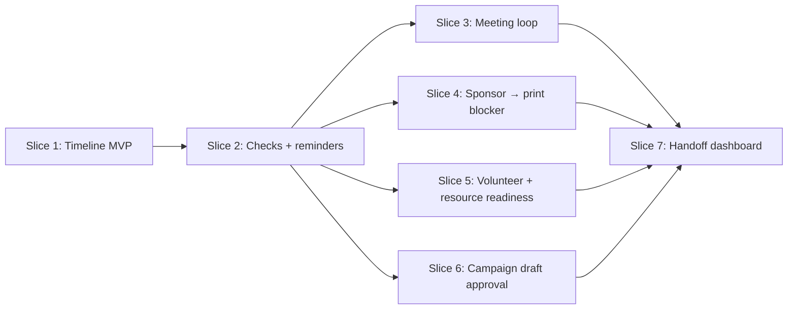

# HTV 2027 Planning / Management System — Vertical Slice Implementation Plan

> **For Hermes:** Use `subagent-driven-development` only after Skylar approves this plan. Do not start implementation from this plan automatically.
>
> Landing this docs-only plan does **not** authorize implementation. Implementation requires separate explicit approval, and any production migration/deploy/send/publish action requires its own gate.

**GitHub issue:** [#86 — Create a complete hackathon planning / management system for Hack the Valley 2027](https://github.com/skylarbpayne/hack-the-valley/issues/86)

**Prior domain artifact:** [`docs/visuals/issue-86-htv-2027-planning-model.html`](../visuals/issue-86-htv-2027-planning-model.html)

**Vertical implementation artifact:** [`docs/visuals/issue-86-vertical-slice-implementation-plan.html`](../visuals/issue-86-vertical-slice-implementation-plan.html)

**Goal:** Convert the approved planning/domain model into a sequence of end-to-end feature slices that can each be built, used, tested, screenshot, and reviewed independently.

**Architecture:** The planning timeline remains the spine, but implementation does **not** proceed table-by-table or layer-by-layer. Each slice owns the minimum schema, domain helpers, API routes, admin UI, tests, and browser evidence needed to validate one real organizer workflow.

**Tech stack:** Cloudflare Worker + D1 + existing session-admin surface, plain JS domain helpers under `functions/_lib/domain/`, Valibot for boundary validation, Node test runner, static admin HTML.

---

## Strategic correction

The old decomposition was too horizontal:

1. schema;
2. API;
3. UI;
4. meetings;
5. sponsorship;
6. volunteers;
7. print;
8. campaigns;
9. reports.

That is tidy on paper and bad in practice. It lets us spend weeks building plumbing without proving whether CSUB can actually run a planning meeting, unblock a print order, or add a new timeline check.

The new rule:

> **Every phase ships a working operator workflow from database → domain command → admin API → admin UI → tests → screenshot evidence.**

If a phase cannot be demonstrated through `/admin`, it is not a complete phase.

---

## Vertical slice rules

1. **One useful workflow per phase.** Do not create generic foundations unless that slice immediately uses them.
2. **Minimal schema per slice.** Add only the tables/columns required for that workflow.
3. **Thin domain helpers first, not a framework.** Put reusable logic in `functions/_lib/domain/planning.js`, but only after a test pulls it into existence.
4. **Admin UI is part of acceptance.** A route-only slice is not done.
5. **Screenshots are required for UI slices.** Put screenshot evidence in the PR body.
6. **External side effects stay gated.** Email sends, social publishing, purchases, production migrations, and deploys require explicit approval.
7. **No content/email lane overreach.** Danny owns HTV content/blog/email flow unless Skylar explicitly asks Palmer into that lane; campaign work here is draft/approval plumbing only.
8. **Progress lives beside the plan.** Keep this approved plan stable. If implementation starts, create `docs/plans/2026-06-24-htv-2027-vertical-slice.progress.md` for receipts/deviations.

---

## Current repo facts this plan assumes

Verified in the planning worktree from `origin/main`:

- Admin surface: `public/admin.html`.
- Worker router: `worker.js` routes `/api/*` to files under `functions/api/`.
- Existing admin command surface: `functions/api/admin/workflows.js`.
- Domain helper pattern: `functions/_lib/domain/*.js`.
- Existing physical resources domain/API exists under:
  - `functions/_lib/domain/physical-resources.js`
  - `functions/api/admin/physical-resources/index.js`
  - `functions/api/admin/physical-resources/[id].js`
- Existing event/platform concepts already distinguish reusable events and concrete instances.
- Tests use Node’s built-in test runner: `npm test`.
- Static checks run through `npm run check`.

Before implementing, re-anchor from fresh `origin/main` and re-check migration numbering. At plan time, next expected migration number is `0025`.

---

## Target implementation shape



**Why Slice 1 is special:** it establishes the smallest usable planning spine. It is still a vertical slice because it ends with a human creating and managing a real timeline item in `/admin`. It must not pre-build every future lane.

---

## Slice 1 — Timeline MVP: create HTV 2027 cycle and manage one planning item

**User story:** As an organizer, I can create the HTV 2027 planning cycle from `/admin`, see the first timeline phases/items, add a one-off planning item, assign an owner label, change status, and see the append-only event history.

**Why first:** This validates the central abstraction before adding sponsorship, print, volunteers, or campaigns. If this feels bad, everything else will be bad with more tables.

### Product scope

Build:

- Planning cycle selector in `/admin`.
- Create HTV 2027 cycle button/form.
- Seeded default phases: `Launch`, `Sponsorship`, `Logistics`, `Event week`, `Post-event`.
- Timeline list grouped by phase.
- Item detail pane with status, owner label, due date, priority, and event history.
- Add item form for one-off task/check/milestone.
- Status updates append `planning_item_events`.

Do **not** build yet:

- check definitions;
- reminders;
- meetings;
- sponsor/print/volunteer specialized objects;
- email/social sends;
- drag-and-drop scheduling;
- recurring automation.

### Files

- Create migration: `migrations/0025_planning_timeline_mvp.sql`
- Modify: `schema.sql`
- Create: `functions/_lib/domain/planning.js`
- Create: `functions/api/admin/planning/cycles/index.js`
- Create: `functions/api/admin/planning/items/index.js`
- Create: `functions/api/admin/planning/items/[id].js`
- Modify: `worker.js`
- Modify: `public/admin.html`
- Create tests: `tests/domain-planning-timeline.test.mjs`
- Create tests: `tests/admin-planning-timeline.test.mjs`
- Create screenshot artifact folder: `docs/visuals/issue-86-slice-01/`

### Minimal schema

```sql
CREATE TABLE IF NOT EXISTS planning_cycles (
  id TEXT PRIMARY KEY,
  event_instance_id TEXT,
  title TEXT NOT NULL,
  status TEXT NOT NULL DEFAULT 'active',
  target_date TEXT,
  created_at TEXT NOT NULL,
  updated_at TEXT NOT NULL
);

CREATE TABLE IF NOT EXISTS timeline_phases (
  id TEXT PRIMARY KEY,
  cycle_id TEXT NOT NULL,
  title TEXT NOT NULL,
  sort_order INTEGER NOT NULL,
  starts_at TEXT,
  ends_at TEXT,
  created_at TEXT NOT NULL,
  updated_at TEXT NOT NULL,
  FOREIGN KEY (cycle_id) REFERENCES planning_cycles(id)
);

CREATE TABLE IF NOT EXISTS planning_items (
  id TEXT PRIMARY KEY,
  cycle_id TEXT NOT NULL,
  phase_id TEXT,
  item_type TEXT NOT NULL,
  title TEXT NOT NULL,
  description TEXT,
  status TEXT NOT NULL DEFAULT 'todo',
  priority TEXT NOT NULL DEFAULT 'normal',
  owner_label TEXT,
  due_at TEXT,
  related_domain TEXT,
  related_id TEXT,
  metadata_json TEXT NOT NULL DEFAULT '{}',
  created_at TEXT NOT NULL,
  updated_at TEXT NOT NULL,
  completed_at TEXT,
  FOREIGN KEY (cycle_id) REFERENCES planning_cycles(id),
  FOREIGN KEY (phase_id) REFERENCES timeline_phases(id)
);

CREATE TABLE IF NOT EXISTS planning_item_events (
  id TEXT PRIMARY KEY,
  item_id TEXT NOT NULL,
  event_type TEXT NOT NULL,
  actor_user_id TEXT,
  actor_label TEXT,
  message TEXT,
  metadata_json TEXT NOT NULL DEFAULT '{}',
  created_at TEXT NOT NULL,
  FOREIGN KEY (item_id) REFERENCES planning_items(id)
);
```

### Domain commands

```js
createPlanningCycle(db, input, actor)
listPlanningCycles(db)
getPlanningTimeline(db, cycleId, filters)
createPlanningItem(db, input, actor)
updatePlanningItemStatus(db, itemId, input, actor)
appendPlanningItemEvent(db, itemId, event, actor)
```

### End-to-end acceptance

- Admin session can create cycle; bootstrap token alone is rejected.
- Cycle creation seeds phases and starter items.
- Admin can add an item with owner label and due date.
- Admin can mark item `in_progress` and `done`.
- Item status changes append event rows; prior events remain visible.
- `/admin` displays the timeline and item detail without exposing external send/publish/order controls.

### Verification

```bash
npm run check
npm test
```

Browser evidence:

- Screenshot: empty state before cycle creation.
- Screenshot: timeline after cycle creation.
- Screenshot: item detail showing event history after status update.
- Console: no JS errors.

---

## Slice 2 — Flexible checks + reminders: add a new timeline check without migration

**User story:** As an organizer, I can add a reusable check definition like “MLH form submitted,” instantiate it into the HTV 2027 timeline, set reminder cadence, and see due reminders on the planning dashboard.

**Why second:** This directly validates Skylar’s flexibility requirement: new checks/items must not require schema churn.

### Product scope

Build:

- Check definition admin UI.
- Instantiate check into current cycle/phase.
- Required evidence labels stored on definition.
- Reminder schedule attached to planning item.
- Due reminders panel on planning dashboard.
- Snooze/dismiss operations that append events.

Do **not** build yet:

- automated email/SMS reminder sends;
- calendar integration;
- generalized notification service;
- recurring cron.

### Files

- Create migration: `migrations/0026_planning_checks_reminders.sql`
- Modify: `schema.sql`
- Extend: `functions/_lib/domain/planning.js`
- Create: `functions/api/admin/planning/check-definitions/index.js`
- Create: `functions/api/admin/planning/reminders/index.js`
- Create: `functions/api/admin/planning/reminders/[id].js`
- Modify: `worker.js`
- Modify: `public/admin.html`
- Create tests: `tests/domain-planning-checks-reminders.test.mjs`
- Create tests: `tests/admin-planning-checks-reminders.test.mjs`
- Screenshot folder: `docs/visuals/issue-86-slice-02/`

### Minimal schema

```sql
CREATE TABLE IF NOT EXISTS check_definitions (
  id TEXT PRIMARY KEY,
  title TEXT NOT NULL,
  description TEXT,
  default_phase_key TEXT,
  default_due_offset_days INTEGER,
  required_evidence_json TEXT NOT NULL DEFAULT '[]',
  default_metadata_json TEXT NOT NULL DEFAULT '{}',
  active INTEGER NOT NULL DEFAULT 1,
  created_at TEXT NOT NULL,
  updated_at TEXT NOT NULL
);

ALTER TABLE planning_items ADD COLUMN check_definition_id TEXT;

CREATE TABLE IF NOT EXISTS planning_reminders (
  id TEXT PRIMARY KEY,
  item_id TEXT NOT NULL,
  cadence TEXT,
  next_due_at TEXT NOT NULL,
  status TEXT NOT NULL DEFAULT 'scheduled',
  created_at TEXT NOT NULL,
  updated_at TEXT NOT NULL,
  FOREIGN KEY (item_id) REFERENCES planning_items(id)
);
```

### Domain commands

```js
createCheckDefinition(db, input, actor)
instantiateCheckDefinition(db, input, actor)
createReminder(db, input, actor)
listDueReminders(db, cycleId, now)
snoozeReminder(db, reminderId, input, actor)
dismissReminder(db, reminderId, input, actor)
```

### End-to-end acceptance

- Admin can create “MLH form submitted” check definition from `/admin`.
- Admin can instantiate the check into HTV 2027 without migration or code change.
- Instantiated check appears as a normal timeline item.
- Due reminder appears in dashboard “needs attention.”
- Snooze/dismiss updates reminder state and appends `planning_item_events`.
- No external reminder send happens.

### Verification

```bash
npm run check
npm test
```

Browser evidence:

- Screenshot: check definition form.
- Screenshot: instantiated check in timeline.
- Screenshot: due reminder panel before and after snooze/dismiss.

---

## Slice 3 — Weekly meeting loop: agenda → notes → follow-up items

**User story:** As the meeting owner, I can open a weekly planning check-in, generate an agenda from due/blocked/reminder items, save notes, and create follow-up items with owners and due dates.

**Why now:** This is the main operating rhythm. If meetings do not create durable follow-ups, the system becomes another dashboard nobody uses.

### Product scope

Build:

- Meeting/check-in panel in `/admin`.
- Agenda generator from:
  - due soon;
  - overdue;
  - blocked;
  - due reminders;
  - recently changed.
- Meeting notes saved as a planning artifact/event.
- Follow-up item creation from the notes panel.
- Internal summary preview only.

Do **not** build yet:

- AI note extraction;
- automatic sends;
- Google Calendar scheduling;
- external recap email.

### Files

- Create migration: `migrations/0027_planning_meetings.sql`
- Modify: `schema.sql`
- Extend: `functions/_lib/domain/planning.js`
- Create: `functions/api/admin/planning/meetings/index.js`
- Create: `functions/api/admin/planning/meetings/[id].js`
- Modify: `worker.js`
- Modify: `public/admin.html`
- Create tests: `tests/domain-planning-meetings.test.mjs`
- Create tests: `tests/admin-planning-meetings.test.mjs`
- Screenshot folder: `docs/visuals/issue-86-slice-03/`

### Minimal schema

```sql
CREATE TABLE IF NOT EXISTS planning_meetings (
  id TEXT PRIMARY KEY,
  cycle_id TEXT NOT NULL,
  title TEXT NOT NULL,
  scheduled_at TEXT,
  notes TEXT,
  summary_json TEXT NOT NULL DEFAULT '{}',
  created_at TEXT NOT NULL,
  updated_at TEXT NOT NULL,
  FOREIGN KEY (cycle_id) REFERENCES planning_cycles(id)
);

CREATE TABLE IF NOT EXISTS planning_artifacts (
  id TEXT PRIMARY KEY,
  item_id TEXT,
  meeting_id TEXT,
  artifact_type TEXT NOT NULL,
  title TEXT NOT NULL,
  url TEXT,
  body TEXT,
  metadata_json TEXT NOT NULL DEFAULT '{}',
  created_at TEXT NOT NULL,
  updated_at TEXT NOT NULL
);
```

### Domain commands

```js
createPlanningMeeting(db, input, actor)
generateMeetingAgenda(db, cycleId, now)
attachMeetingNotes(db, meetingId, input, actor)
createFollowupItemsFromMeeting(db, meetingId, items, actor)
```

### End-to-end acceptance

- Agenda generator returns due/blocked/reminder/recently changed items grouped by lane.
- Organizer can save notes.
- Organizer can create follow-up items from notes without leaving the meeting panel.
- Follow-ups appear in the timeline with owner/due/status.
- Internal summary is displayed but not sent externally.

### Verification

```bash
npm run check
npm test
```

Browser evidence:

- Screenshot: generated agenda.
- Screenshot: notes saved.
- Screenshot: follow-up item appears in timeline after meeting.

---

## Slice 4 — Sponsor asset → print order blocker: prove cross-domain dependencies

**User story:** As a sponsorship/logistics organizer, I can track a sponsor commitment, require logo evidence, create a print order that depends on that logo, and request approval before placing the vendor order.

**Why now:** This is the first real cross-domain workflow and the best test that the planning spine is not fake abstraction sludge.

### Product scope

Build:

- Minimal sponsor lead/commitment model.
- Sponsor logo/evidence planning item.
- Minimal print order model.
- Planning dependency from sponsor logo item → print order item.
- Blocked/ready rollup shown in `/admin`.
- Spend/vendor approval request before “ordered.”

Do **not** build yet:

- full CRM;
- invoice/payment automation;
- vendor email sends;
- public sponsor page;
- social post generation.

### Files

- Create migration: `migrations/0028_sponsor_print_dependency.sql`
- Modify: `schema.sql`
- Extend: `functions/_lib/domain/planning.js`
- Create: `functions/_lib/domain/sponsorship.js`
- Create: `functions/_lib/domain/print-orders.js`
- Create: `functions/api/admin/sponsors/index.js`
- Create: `functions/api/admin/print-orders/index.js`
- Create: `functions/api/admin/planning/dependencies/index.js`
- Modify: `worker.js`
- Modify: `public/admin.html`
- Create tests: `tests/domain-sponsor-print-planning.test.mjs`
- Create tests: `tests/admin-sponsor-print-planning.test.mjs`
- Screenshot folder: `docs/visuals/issue-86-slice-04/`

### Minimal schema

```sql
CREATE TABLE IF NOT EXISTS sponsor_leads (
  id TEXT PRIMARY KEY,
  cycle_id TEXT NOT NULL,
  organization_name TEXT NOT NULL,
  status TEXT NOT NULL DEFAULT 'lead',
  tier TEXT,
  owner_label TEXT,
  metadata_json TEXT NOT NULL DEFAULT '{}',
  created_at TEXT NOT NULL,
  updated_at TEXT NOT NULL
);

CREATE TABLE IF NOT EXISTS print_orders (
  id TEXT PRIMARY KEY,
  cycle_id TEXT NOT NULL,
  title TEXT NOT NULL,
  status TEXT NOT NULL DEFAULT 'draft',
  vendor_name TEXT,
  quantity INTEGER,
  approval_state TEXT NOT NULL DEFAULT 'none',
  metadata_json TEXT NOT NULL DEFAULT '{}',
  created_at TEXT NOT NULL,
  updated_at TEXT NOT NULL
);

CREATE TABLE IF NOT EXISTS planning_dependencies (
  id TEXT PRIMARY KEY,
  blocking_item_id TEXT NOT NULL,
  blocked_item_id TEXT NOT NULL,
  dependency_type TEXT NOT NULL DEFAULT 'hard',
  status TEXT NOT NULL DEFAULT 'active',
  created_at TEXT NOT NULL,
  updated_at TEXT NOT NULL,
  FOREIGN KEY (blocking_item_id) REFERENCES planning_items(id),
  FOREIGN KEY (blocked_item_id) REFERENCES planning_items(id)
);
```

### Domain commands

```js
createSponsorLead(db, input, actor)
createSponsorLogoCheck(db, sponsorLeadId, input, actor)
createPrintOrder(db, input, actor)
createPlanningDependency(db, input, actor)
recomputePlanningBlockedState(db, itemId)
requestPrintOrderApproval(db, printOrderId, input, actor)
```

### End-to-end acceptance

- Sponsor lead can be created from `/admin`.
- Sponsor logo check appears as a timeline item.
- Print order appears as a timeline item.
- Print order is visibly blocked by sponsor logo check.
- Completing logo check recomputes print order to ready.
- Ordering/spend action is approval-gated and cannot be self-approved from forged request body.

### Verification

```bash
npm run check
npm test
```

Browser evidence:

- Screenshot: sponsor lead with logo check.
- Screenshot: print order blocked by sponsor logo.
- Screenshot: print order ready after evidence attached.
- Screenshot: approval gate before vendor order.

---

## Slice 5 — Volunteer + resource readiness: coverage gaps and inventory blockers

**User story:** As an organizer, I can convert helper interest into volunteer role coverage, see shift gaps as planning blockers, and link physical resources/checkouts to event-week readiness items.

**Why now:** This validates that the system can coordinate people and things, not just abstract tasks.

### Product scope

Build:

- Volunteer role/shift requirement model.
- Promote existing `helper_interests` into volunteer candidates/assignments.
- Coverage gaps create/attach planning items.
- Link existing `physical_resources` to readiness planning items.
- Event-week readiness panel groups volunteer gaps and resource gaps.

Do **not** build yet:

- public volunteer portal;
- volunteer mass email;
- advanced scheduling optimizer;
- safety-sensitive data export.

### Files

- Create migration: `migrations/0029_volunteer_resource_readiness.sql`
- Modify: `schema.sql`
- Create: `functions/_lib/domain/volunteers.js`
- Extend: `functions/_lib/domain/planning.js`
- Extend: `functions/_lib/domain/physical-resources.js` only where needed for planning links
- Create: `functions/api/admin/volunteers/index.js`
- Create: `functions/api/admin/planning/readiness/index.js`
- Modify: `worker.js`
- Modify: `public/admin.html`
- Create tests: `tests/domain-volunteer-readiness.test.mjs`
- Create tests: `tests/admin-volunteer-readiness.test.mjs`
- Screenshot folder: `docs/visuals/issue-86-slice-05/`

### Minimal schema

```sql
CREATE TABLE IF NOT EXISTS volunteer_roles (
  id TEXT PRIMARY KEY,
  cycle_id TEXT NOT NULL,
  title TEXT NOT NULL,
  required_count INTEGER NOT NULL DEFAULT 1,
  owner_label TEXT,
  metadata_json TEXT NOT NULL DEFAULT '{}',
  created_at TEXT NOT NULL,
  updated_at TEXT NOT NULL
);

CREATE TABLE IF NOT EXISTS volunteer_assignments (
  id TEXT PRIMARY KEY,
  volunteer_role_id TEXT NOT NULL,
  user_id TEXT,
  contact_label TEXT,
  status TEXT NOT NULL DEFAULT 'candidate',
  created_at TEXT NOT NULL,
  updated_at TEXT NOT NULL,
  FOREIGN KEY (volunteer_role_id) REFERENCES volunteer_roles(id)
);

ALTER TABLE physical_resources ADD COLUMN planning_item_id TEXT;
```

### Domain commands

```js
createVolunteerRole(db, input, actor)
promoteHelperInterestToVolunteer(db, helperInterestId, input, actor)
assignVolunteer(db, volunteerRoleId, input, actor)
listReadinessGaps(db, cycleId)
linkPhysicalResourceToPlanningItem(db, resourceId, itemId, actor)
```

### End-to-end acceptance

- Admin can define a volunteer role and required coverage.
- Existing helper interest can be promoted to candidate/assignment.
- Understaffed roles appear as readiness gaps and planning blockers.
- Physical resource can be linked to event-week readiness item.
- Resource checkout/return state contributes to readiness view without exposing inventory publicly.

### Verification

```bash
npm run check
npm test
```

Browser evidence:

- Screenshot: volunteer coverage gap.
- Screenshot: promoted helper interest.
- Screenshot: event-week readiness panel with people + resource blockers.

---

## Slice 6 — Campaign draft approval: social/email planning without accidental sends

**User story:** As an organizer, I can draft a campaign item, preview audience/channel metadata, request approval, and see approval state — without sending email or publishing social content.

**Why late:** It touches the highest blast-radius lane. Draft/review is useful; actual sends/publishes should remain a separate explicit approval gate.

### Product scope

Build:

- Campaign draft object linked to planning item.
- Channel: `email`, `social`, or `mixed`.
- Audience preview metadata for email; no provider call unless explicitly approved in a later send slice.
- Approval request state and provenance.
- Campaign lane on planning dashboard.

Do **not** build yet:

- Resend broadcast send;
- scheduled social publish;
- auto-generated copy;
- blog/content management;
- Danny’s content/email lane.

### Files

- Create migration: `migrations/0030_campaign_draft_approval.sql`
- Modify: `schema.sql`
- Create: `functions/_lib/domain/campaigns.js`
- Extend: `functions/_lib/domain/planning.js`
- Create: `functions/api/admin/campaigns/index.js`
- Create: `functions/api/admin/campaigns/[id].js`
- Modify: `worker.js`
- Modify: `public/admin.html`
- Create tests: `tests/domain-campaign-drafts.test.mjs`
- Create tests: `tests/admin-campaign-drafts.test.mjs`
- Screenshot folder: `docs/visuals/issue-86-slice-06/`

### Minimal schema

```sql
CREATE TABLE IF NOT EXISTS campaign_drafts (
  id TEXT PRIMARY KEY,
  cycle_id TEXT NOT NULL,
  planning_item_id TEXT,
  title TEXT NOT NULL,
  channel TEXT NOT NULL,
  status TEXT NOT NULL DEFAULT 'draft',
  audience_preview_json TEXT NOT NULL DEFAULT '{}',
  approval_state TEXT NOT NULL DEFAULT 'none',
  body_draft TEXT,
  metadata_json TEXT NOT NULL DEFAULT '{}',
  created_at TEXT NOT NULL,
  updated_at TEXT NOT NULL,
  FOREIGN KEY (planning_item_id) REFERENCES planning_items(id)
);
```

### Domain commands

```js
createCampaignDraft(db, input, actor)
previewCampaignAudience(db, draftId, actor)
requestCampaignApproval(db, draftId, input, actor)
recordCampaignApprovalDecision(db, draftId, input, actor)
```

### End-to-end acceptance

- Campaign draft can be created from `/admin` and appears on timeline.
- Audience/channel preview is visible.
- Request approval changes state and appends event/audit provenance.
- No send/schedule/publish button exists in this slice.
- Forged body fields cannot self-approve or spoof actor provenance.

### Verification

```bash
npm run check
npm test
```

Browser evidence:

- Screenshot: campaign draft detail.
- Screenshot: approval-request state.
- Screenshot: absence of send/publish controls before explicit future approval.

---

## Slice 7 — Handoff dashboard: weekly truth, blockers, owners, approvals

**User story:** As Skylar or CSUB leadership, I can open the planning dashboard and immediately see what is due this week, what is blocked, who owns what, what needs approval, and what evidence is missing.

**Why last:** It is a read model over real features. Building it first would be dashboard theater.

### Product scope

Build:

- One-page planning health summary in `/admin`.
- Cards:
  - due this week;
  - overdue;
  - blocked;
  - ownerless;
  - needs approval;
  - missing evidence;
  - readiness gaps.
- Export button for admin-only CSV/JSON snapshot.
- Handoff notes explaining what each card means.

Do **not** build yet:

- public dashboard;
- automated external reports;
- Slack/Discord/email pushes;
- predictive analytics.

### Files

- Extend: `functions/_lib/domain/planning.js`
- Create: `functions/api/admin/planning/dashboard/index.js`
- Modify: `worker.js`
- Modify: `public/admin.html`
- Create tests: `tests/domain-planning-dashboard.test.mjs`
- Create tests: `tests/admin-planning-dashboard.test.mjs`
- Screenshot folder: `docs/visuals/issue-86-slice-07/`

### Read model contract

```js
PlanningDashboard = {
  cycle,
  counts: {
    due_this_week,
    overdue,
    blocked,
    ownerless,
    needs_approval,
    missing_evidence,
    readiness_gaps
  },
  sections: {
    due_this_week: [],
    blocked: [],
    approvals: [],
    readiness: [],
    recent_changes: []
  }
}
```

### End-to-end acceptance

- Dashboard reflects data created in prior slices.
- Each dashboard row links to the relevant planning item/lane detail.
- Export excludes private contact/safety details unless clearly admin-only and intentionally included.
- Empty state explains what to do next, not “no data.”

### Verification

```bash
npm run check
npm test
```

Browser evidence:

- Screenshot: populated handoff dashboard.
- Screenshot: blocked + approval sections.
- Screenshot: export confirmation or downloaded fixture shape.

---

## Issue/PR packaging strategy

Each slice should become one GitHub issue and one PR unless Skylar explicitly approves combining them.

Recommended issue titles:

1. `Issue #86 slice 1: Planning timeline MVP`
2. `Issue #86 slice 2: Flexible checks and reminders`
3. `Issue #86 slice 3: Weekly planning check-in loop`
4. `Issue #86 slice 4: Sponsor asset to print order blocker`
5. `Issue #86 slice 5: Volunteer and resource readiness`
6. `Issue #86 slice 6: Campaign draft approval lane`
7. `Issue #86 slice 7: Handoff dashboard and exports`

Each PR body must include:

- user workflow implemented;
- files changed;
- migrations added;
- local verification output;
- screenshot links;
- explicit external side-effect statement;
- whether production deploy/migration is requested or still gated.

---

## Local implementation protocol

For each slice:

1. Create a fresh worktree from current `origin/main`.
2. Confirm current migration numbering.
3. Write/adjust domain tests first.
4. Implement minimal domain helper.
5. Add route tests.
6. Implement API route.
7. Add admin UI and browser smoke.
8. Run:

```bash
npm run check
npm test
git diff --check
```

9. Capture screenshots from real browser route, not raw file preview.
10. Commit with one coherent message.
11. Open PR with screenshot evidence.
12. Stop for Skylar approval before merge/deploy if migrations/public behavior are involved.

---

## Anti-patterns / loopholes

- Do not build all planning tables first “because they are foundational.” That is horizontal slicing wearing a fake mustache.
- Do not add sponsor/print/volunteer/campaign domain files until the slice that uses them end-to-end.
- Do not claim route tests prove the feature if `/admin` cannot exercise it.
- Do not expose email send, social publish, vendor order, purchase, or production migration as a casual button.
- Do not let `metadata_json` become a trash bag. Common planning fields belong on `planning_items`; lane-specific extras belong in typed lane tables once the lane proves itself.
- Do not create a generic CRM or project-management clone.
- Do not edit this approved plan during implementation to make drift look compliant. Use a progress file and stop for approval if the plan needs revision.
- Do not enter Danny’s content/blog/email lane beyond draft/approval plumbing unless Skylar explicitly scopes it.

---

## Approval gates

Safe without additional approval:

- repo-local docs and visual artifacts;
- local tests;
- local commits/branches;
- opening a docs/planning PR if requested.

Ask before:

- starting implementation from this plan;
- applying production D1 migrations;
- deploying public behavior;
- sending/scheduling email;
- posting/scheduling social content;
- making purchases or vendor orders;
- changing real event dates, venues, or capacity;
- merging PRs that trigger production workflows.

---

## Recommended next move

If Skylar approves this vertical plan, start with **Slice 1: Planning timeline MVP** only.

Do not spawn all seven slices at once. The point of vertical slicing is to learn from the first usable workflow before multiplying code paths.
