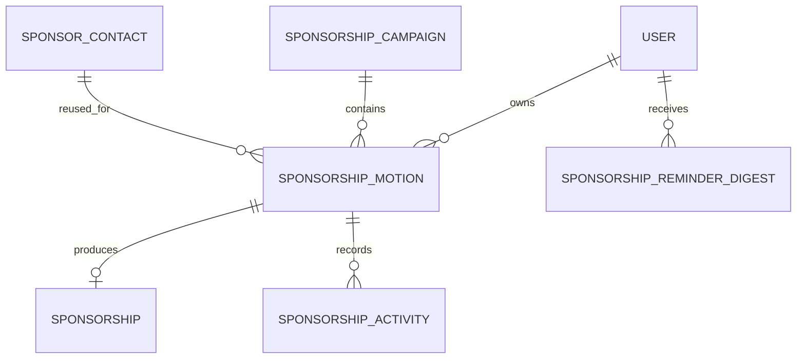

# HTV sponsorship management: local prototype plan

Date: September 24, 2026  
Status: Implementation in progress on `codex/sponsorship-prototype`.  
Scope: Functional local prototype with seeded data, persistent local database, local logo storage, and an overdue-reminder preview inbox.

Engineering requirements: Test-driven development for feature behavior, and retry-safe mutations with explicit idempotency tests.

## Outcome

Give HTV admins one place to review sponsorship outreach each week: who owns each prospect, what has happened, what happens next, and which follow-ups are overdue. Reuse business contacts across annual campaigns and keep actual commitments separate from outreach.

The first deliverable runs locally without production credentials. Real email delivery and production deployment are later integration steps.

## Agreed product decisions

| Area | Decision |
| --- | --- |
| Access | Active global `admin` and `super_admin` users can view and edit every sponsorship record. Ordinary club members cannot. Ownership denotes responsibility, not a visibility restriction. |
| Contacts | One reusable business record with one primary contact. Business name, contact name, email, and business/contact details live here. |
| Campaigns | Named annual/event efforts such as “HTV 2027,” optionally linked to an existing event. |
| Outreach | One sponsorship motion per contact per campaign, with an HTV admin owner, status, notes, completed activity, next action, and follow-up date. |
| Statuses | **Not contacted, Contacted, Followup, Interest, Negotiating, Lost, Committed, Paid.** |
| Commitments | At most one sponsorship per motion, created when the motion becomes Committed. |
| Sponsorship details | Cash and/or in-kind contributions; amount committed and received; payment method; check reference; invoice number/status; donated goods/services description; fulfillment checkbox; logo upload. |
| Payment documents | Reference fields only; invoice/check attachments and invoice generation are outside this prototype. |
| Weekly review | See what was done, next action, follow-up date, and overdue highlighting. Filter by campaign, status, and owner. |
| Reminders | One daily summary per owner at 9 a.m. Pacific, only when they have overdue, unfinished follow-ups. Exclude Lost and Paid motions. |
| Local notifications | Preview inbox only; no real outbound email from the prototype. |

## Existing code to build on

Initial planning inspected `631371d`. Implementation refreshed upstream and starts from `853c27f` on `codex/sponsorship-prototype`; production deployment state remains unverified.

- `worker.js` explicitly registers API routes and already has a scheduled handler for blog reconciliation.
- `wrangler.toml` binds D1 as `HTV_DB`, R2 as `SUBMISSIONS_MEDIA`, and now schedules blog reconciliation daily at 15:00 UTC. The isolated prototype configuration uses a 15-minute schedule for reminder previews.
- `functions/_lib/event-platform.js` provides login, sessions, `requireAdmin`, error handling, and D1 access. Its admin helper permits an optional bootstrap token; sponsorship routes must additionally require a real signed-in user, following the physical-resources routes.
- `functions/api/admin/physical-resources/` and `functions/_lib/domain/physical-resources.js` provide examples of admin-only CRUD and private media handling.
- `functions/_lib/domain/shared.js` provides Valibot validation helpers; `domain/audit.js` provides audit records.
- `/admin` is the organizer entry point. `/login/` already supports local development codes through both `HTV_AUTH_DEV_CODES=1` and `HTV_AUTH_DEV_MODE=local`.
- `scripts/check-migrations.mjs` checks migrations in a disposable local database; the test suite uses Node's test runner.
- `scripts/seed-admin-roles.mjs` defaults toward a remote target unless `--local` is supplied. The prototype needs a dedicated local-only seed flow.

Keep the JavaScript Worker, static HTML/JS frontend, D1, and R2 architecture. No FastAPI service or new frontend framework is needed. Public event pages and signup flows retain their existing routes.

## Data model

Use `SponsorshipCampaign` in code and `sponsorship_campaigns` in storage to avoid confusion with the existing domain document's outbound-email “Campaign” concept.



Proposed new tables:

| Table | Principal fields and constraints |
| --- | --- |
| `sponsor_contacts` | `id`, `business_name`, `contact_name`, `email`, optional phone/website, general notes, timestamps, actor IDs, revision. One row represents a business and its primary contact. Email may be absent for an unresearched prospect; validate it when present. |
| `sponsorship_campaigns` | `id`, name, year, purpose, optional `event_instance_id` referencing the existing event-instance model, `archived_at`, timestamps, actor IDs, revision. Annual campaigns need no event link. |
| `sponsorship_motions` | `id`, contact/campaign/owner IDs, status, campaign-specific notes, `next_action`, `follow_up_on`, `follow_up_completed_at`, timestamps, actor IDs, revision. Unique `(contact_id, campaign_id)`; owner references `users`. |
| `sponsorships` | `id`, unique `motion_id`, contribution type (`cash`, `in_kind`, `both`), committed/received cash amounts in integer cents, USD currency, donation description, fulfillment timestamp, payment method, check reference, invoice number/status, private logo metadata, timestamps, actor IDs, revision. |
| `sponsorship_activities` | `id`, motion ID, actor ID, activity type, description, timestamp. Append-only entries for outreach performed and significant status/follow-up changes. |
| `sponsorship_reminder_digests` | `id`, owner ID, Pacific calendar date, mode, recipient, subject/body snapshot, motion IDs, status, timestamps. Unique `(owner_user_id, local_date, mode)` prevents duplicate daily previews. |
| `sponsorship_mutation_receipts` | Actor ID, operation/target, client idempotency key, normalized request fingerprint, successful response status/body, and completion timestamp. Unique `(actor_user_id, operation, idempotency_key)`. Persist with the corresponding database mutation; retain for the life of the local prototype store. |

Implementation rules:

- Enforce foreign keys, status/type checks, and uniqueness in SQL. Index campaign/status, owner/follow-up date, and motion/activity time.
- Search the contacts bank before adding a business; warn about matching names or websites. Do not use email as a business ID or assume two businesses cannot share an email.
- Edit contact details from either the contacts bank or the outreach detail view; explain that this updates the reusable contact across campaigns.
- Require an active global admin owner on creation/reassignment. If their role is later revoked, retain history, flag the motion for reassignment, and exclude that owner from reminders.
- Keep previous campaigns and their outreach history. Adding a contact to a new campaign creates a fresh Not contacted motion, without copying payments, outreach notes, or dates.
- Store timestamps in UTC and follow-up dates as Pacific-calendar `YYYY-MM-DD` values. Keep money in cents; reject negative values and malformed monetary input.
- Use revision checks to reject stale edits with `409`, retaining the user's draft for review. Related writes must succeed together, including activity and audit records. D1 supports transactional batches; test rollback and guarded updates against actual local D1, including the case where an optimistic update changes zero rows. [D1 batch documentation](https://developers.cloudflare.com/d1/worker-api/d1-database/#batch)

## Workflow and consistency rules

### Outreach and weekly review

Admins can move between the outreach statuses without following a rigid sales sequence. A new prospect starts at Not contacted. An activity entry captures a completed call, email, meeting, or other action; editable notes hold the current summary.

Completing a follow-up records completion and activity. Scheduling the next follow-up sets a new next action/date and clears completion for that new task. Changing an unrelated field does not reopen a completed follow-up.

Define overdue once in the domain layer and use the same rule for the page, filters, and reminders:

`follow_up_on < today's date in America/Los_Angeles`, the follow-up is unfinished, the campaign is active, and the motion is neither Lost nor Paid.

A task due today is not overdue. Missing dates are not overdue. Unfinished tasks remain eligible on subsequent days until completed, rescheduled, or excluded by campaign/status.

### Committed and Paid

- Moving to Committed atomically creates the linked sponsorship if absent. Repeating the action reuses it.
- A newly created commitment may have an unknown amount until the admin fills in the details. Unknown or zero amounts never cause an automatic Paid status.
- For cash or mixed contributions, derive Paid when the positive committed cash amount is fully received (`received >= committed`). Partial payments remain Committed. Changing amounts recalculates payment status while the motion is Committed/Paid; unrelated outreach states are not silently overwritten.
- Selecting Paid in the UI opens payment details. The server rejects a Paid state unsupported by the recorded amounts.
- An in-kind-only contribution remains Committed, with fulfillment tracked separately. For mixed contributions, Paid reflects cash settlement; the sponsorship view must still show any outstanding in-kind fulfillment.
- Keep the agreed reminder exclusion for Paid even if a mixed sponsorship has an outstanding in-kind item. Do not quietly add a separate fulfillment-reminder policy.
- Payment method options are check, bank transfer, cash, and other. Check reference and invoice number are optional reference fields. Invoice status is not issued, issued, or paid; only mark an issued invoice paid when the cash obligation is settled.
- Reopening or losing a motion retains its sponsorship and payment history. Current commitment totals include only Committed/Paid motions; historical records remain visible with their current motion status.

### Logos

Store uploaded logo files in local R2 under a sponsorship-specific prefix and metadata on the sponsorship. Serve through an admin-authenticated endpoint. Support PNG, JPEG, and WebP up to a proposed 5 MB limit, with size/type validation and generated object keys. Replace the old object only after the new reference is saved successfully. Keep SVG support and public sponsor-logo publishing for a later iteration.

## Admin experience

Add a Sponsorships entry in `/admin`, linking to `/admin-sponsorships`. Keep the new page's behavior in a separate JavaScript module rather than growing the existing large inline script.

| View | Behavior |
| --- | --- |
| Outreach | Default weekly-review table: business name, contact name, email, owner, status, notes/latest activity, next action, follow-up date. Campaign selector, status/owner filters, and overdue-only toggle. Clear overdue label and date, not color alone. |
| Add/edit prospect | Choose an existing contact or create one; assign campaign and owner; save status, notes, and follow-up. Simple row editing or a detail panel, with visible save/error feedback. |
| Contacts bank | Search, add, and update reusable businesses and primary contacts; view past campaign relationships; add a selected contact to another campaign. |
| Sponsorships | Separate commitment view with cash committed/received, outstanding amount, donation details, fulfillment, payment/invoice references, and logo upload/preview. |
| Reminder inbox | Local preview messages grouped by owner and date. Show recipient, overdue items, next action, and direct links to records. Visible “Preview only” label. |

Provide create/edit/archive campaign controls. Closed campaigns remain readable. Editing forms should use accessible labels, keyboard navigation, useful empty/loading/error states, and a usable narrow-screen layout. Preserve Inter and the existing HTV colors.

## API and domain boundaries

Use `/api/admin/sponsorships` as the base namespace. Every operation, including logo reads and preview inbox reads, requires an active global admin session; reject bootstrap-token-only access. Return private responses with `Cache-Control: no-store`.

| Route suffix | Operations |
| --- | --- |
| `/owners` | `GET` eligible owner IDs, display names, and emails. |
| `/contacts`, `/contacts/:id` | List/search, create, and update reusable contacts. |
| `/campaigns`, `/campaigns/:id` | List, create, update, and archive campaigns. |
| `/motions`, `/motions/:id` | Filtered/paginated list, create, detail, and update. Include contact/owner projections for the review table. |
| `/motions/:id/activities` | Read timeline and append completed outreach activity. |
| `/motions/:id/commitment` | Read/update the motion's one sponsorship. Creation belongs to the Committed transition. |
| `/motions/:id/logo` | Authenticated upload/read of the commitment logo. |
| `/reminders` | Read captured local preview digests. |
| `/reminders/preview` | Generate previews for eligible overdue items; local-preview mode only. Never send an email. |

Use `GET`, `POST`, and `PATCH` where appropriate, with thin route handlers delegating to domain modules. Validate writes server-side, bind SQL parameters, and escape user-supplied text in HTML/email rendering. Return `401` for missing sessions, `403` for insufficient access, `404` for missing records, `409` for duplicates/stale edits, and existing-style `400` validation errors. Validate same-origin browser mutations and accepted content types.

Suggested domain split: `sponsorships.js` owns contacts, campaigns, motions, commitments, and state changes; `sponsorship-reminders.js` owns eligibility, owner grouping, rendering, and daily deduplication. Reuse generic audit events for business changes; do not duplicate authentication or create new sponsorship-specific user accounts.

## Idempotency contract

Repeating the same intended operation must not create another business record, payment effect, activity entry, audit event, logo version, or reminder. Enforce this on the server and in database constraints; disabling a Save button is only a UI convenience.

- Each UI save/create/upload generates an `Idempotency-Key`. Reuse it when retrying that request after a timeout or network failure. A new intentional action or edited payload receives a new key.
- Scope receipts by authenticated actor and operation/target. Authenticate and authorize every request before replaying a stored result, including when the user's role has since been revoked.
- Same key and same normalized payload returns the original successful status/body with no new business side effects. Same key with a different payload returns `409`. Include the expected revision in the fingerprint and the file-content digest for uploads.
- Check an existing successful receipt before checking the current resource revision. Otherwise a retry after a successful-but-lost response would incorrectly fail as a stale edit. New requests still require revision checks.
- Commit the receipt, business change, activity, and audit entry in one D1 transaction. A failure rolls back all of them. Concurrent same-key requests must resolve to one committed operation and its stored result; do not use a read-then-insert check as the only protection.
- Use uniqueness for business invariants separately from retry detection: a different request creating the same contact/campaign motion returns a duplicate conflict, while a retry of the original request returns its original success.
- Payment edits set the total amount received, rather than incrementing it on each retry. If installment records are introduced later, give each installment its own unique operation identity.
- For logo uploads, use an object key derived from the target and operation identity, bound to the content digest. R2 and D1 do not form one transaction: explicitly handle an upload succeeding before metadata fails, retries, and unreferenced-file cleanup. Never remove the currently referenced logo during failure recovery.
- Daily reminder uniqueness remains `(owner, Pacific date, mode)`, even when concurrent callers use different request keys. Read-only refreshed previews do not insert another digest.
- Local setup uses migration tracking and stable fixture IDs. A second setup applies only missing migrations/fixtures and preserves edited sample records; it does not rerun destructive SQL or reset follow-up dates.

The local prototype proves duplicate prevention and recovery for these local operations. Future real email requires provider idempotency and delivery recovery as well; a local receipt alone cannot guarantee exactly-once external delivery.

## Test-driven development workflow

Use small vertical slices throughout phases 1–4; tests are not deferred to the final verification phase.

1. **Red:** write one focused test for the next observable requirement and run it. Confirm it fails because that behavior is missing or incorrect, rather than because the test environment is broken.
2. **Green:** implement the smallest complete behavior that makes the test pass, including the required authorization and data constraints.
3. **Refactor:** improve naming and structure while keeping the test green; run the affected tests again after changes.
4. Repeat for the next behavior or edge case. When a bug appears, add a reproducing regression test before fixing it.

Keep the existing Node test runner. Use focused domain tests for status/payment/date rules, API tests for permissions and retry contracts, actual local D1 integration tests for uniqueness/rollback/concurrency, and a small number of browser tests for complete user workflows. Inject time and fake outbound transports for deterministic tests. Avoid tests that merely assert private helper calls, source-code strings, or trivial presentation details.

For each mutation, cover the behavior applicable to that operation: first success, exact replay, changed-payload key reuse, concurrent duplicate requests, and a failure followed by retry. Verify final database state and activity/audit counts, not only HTTP responses. Include the lost-response case: the first request commits, the client receives no response, and retry returns the saved result without repeating the effect.

Record the initial failing test and passing result in implementation notes or the PR validation summary. Run focused checks during each slice and the full required suite at the completion gates; no percentage target substitutes for covering the identified business rules.

## Overdue reminder scheduling

Extend the existing scheduled handler; the isolated local configuration supplies a 15-minute trigger while the production blog schedule stays unchanged. Evaluate the scheduled timestamp in `America/Los_Angeles` and process the daily digest at 9 a.m. Pacific, with retries during the 9 a.m. hour. The daily unique key makes later ticks no-ops after success. Cloudflare cron schedules are UTC, so use timezone-aware code rather than a fixed UTC offset. [Cron trigger documentation](https://developers.cloudflare.com/workers/configuration/cron-triggers/)

1. Select overdue, unfinished motions from active campaigns, excluding Lost/Paid.
2. Join active admin owners and group across campaigns by owner.
3. If an owner has no eligible items, create no message and no empty notification.
4. Render a concise summary containing business, campaign, days overdue, next action, and record link.
5. Insert the preview snapshot and daily deduplication record atomically. Concurrent ticks produce one inbox entry per owner/date.
6. Run the existing blog reconciliation independently, so an error in either job does not stop the other.

The local preview action may run the same eligibility/rendering flow at any time of day; it still excludes non-overdue items and deduplicates the captured daily summary. Provide a read-only refreshed preview if today's saved snapshot is already present. Tests can inject time without changing the computer clock. Local scheduled runs are explicitly simulated during testing; the prototype is not an always-running notification service.

Future real delivery should use a separate Resend transport, default disabled, with an explicit sender configuration. It will need persisted delivery attempts, stable provider idempotency keys, bounded retries, and visible failures; provider acceptance must not be described as confirmed delivery. Do not enable real sends as part of this prototype.

## Local environment and sample data

Create a local-only launcher/configuration using the same Worker with local D1/R2 bindings and a dedicated ignored persistence directory, such as `.wrangler/sponsorship-prototype/`. Local D1 supports persistence and queries through Wrangler without using the remote database. [D1 local development](https://developers.cloudflare.com/d1/best-practices/local-development/)

Proposed developer commands, to be added during implementation:

```bash
npm run sponsorships:setup:local
npm run sponsorships:dev
```

- Setup applies migrations and inserts deterministic fictional fixtures only when missing. Re-running it preserves user edits and does not duplicate records.
- Use a generated local config with resolved local binding IDs, explicit paths to the existing Worker/assets/migrations, and a separate persistence path. Do not depend on unresolved production database IDs.
- Refuse remote flags/targets in the setup script. Keep real Cloudflare/Resend credentials out of the local launch environment and avoid loading production `.dev.vars` or `.cloudflare.env` files.
- Enable existing development-code login only in that local config. Sign in through the real login/session/role flow, rather than bypassing authorization.
- Seed Danny Demo and another demo admin, plus an ordinary member for access-denial testing, all at `example.com` addresses. These are fictional local identities, not production accounts.
- Seed two campaigns and about ten fictional businesses, including one reused across years. Include every requested status, partial/full cash payments, in-kind and mixed contributions, an invoice/check example, and a sample logo.
- Generate sample follow-up dates relative to the Pacific date at initial setup: overdue, due today, future, missing, and completed. Include Lost/Paid records with old dates to demonstrate exclusion.
- Provide an explicit reset command limited to this dedicated local store; do not reset the DB on ordinary startup. Test persistence after restart.

## Implementation sequence and acceptance gates

### 1. Local foundation and schema

Before coding, refresh upstream and start an isolated `codex/sponsorship-prototype` branch from the appropriate upstream base, preserving unrelated work and this plan. Resolve any newer migration numbering first.

Add the next available migration (currently proposed `0026_sponsorship_management.sql`), follow upstream AGENTS.md: migrations are the only schema source (do not recreate schema.sql), add the local launcher/seed scripts, and document the commands.

**Tests first:** add failing local integration cases for the new relationship constraints and repeated setup preserving edited fixtures. As the protected API entry point is added, first prove member/bootstrap access is rejected and admin access succeeds.

**Gate:** fresh local setup works without Cloudflare credentials; migrations apply; repeat setup is non-destructive; seeded admins sign in through the existing flow; the ordinary member cannot access sponsorship APIs.

### 2. Contacts, campaigns, and outreach

Add domain validation/queries, Worker route registration, contact/campaign/motion APIs, activity history, audit records, and revision checks. Implement the contacts bank and weekly-review view with add/edit/filter controls.

**Tests first:** before each operation, specify its validation and access behavior; then add replay, duplicate-motion, stale-edit, activity-history, and cross-campaign isolation cases as their slices are implemented. Require real D1 rollback/concurrency tests for mutation receipts.

**Gate:** an admin adds and edits a sponsor, assigns another admin, filters statuses, records work completed, and schedules/completes a follow-up. Reuse the contact in the next campaign without changing the prior campaign's outreach history. Duplicate motions return a useful conflict.

### 3. Commitments, payment tracking, and logos

Implement the unique commitment relationship, cash/in-kind fields, Committed/Paid consistency, payment references, fulfillment, and private logo storage/preview.

**Tests first:** introduce commitment-creation, payment-transition, and retry cases before each corresponding implementation. Add a failing upload-recovery case before implementing the R2/D1 recovery path; assert failed or replayed saves do not duplicate audit/activity entries.

**Gate:** repeated commitment actions create one record; partial payments remain Committed; full payment becomes Paid; reducing payment recalculates status; in-kind-only records never become Paid automatically; uploads persist and reject unauthorized requests.

### 4. Overdue reminders and preview inbox

Implement the shared overdue predicate, owner digest rendering, deduplication, local preview controls, and scheduled-handler integration.

**Tests first:** establish overdue-date and status eligibility with an injected clock, then test grouping, daily/concurrent deduplication, next-day eligibility, daylight-saving boundaries, and independent scheduled-job failures before implementing each behavior.

**Gate:** only owners with overdue eligible records get preview messages; other owners' tasks are absent; running twice produces one daily message per owner; tomorrow can produce a new message if work remains overdue; daylight-saving changes retain 9 a.m. Pacific behavior. No external emails are sent.

### 5. Verification and review handoff

Run the domain/API and local D1 tests built throughout the earlier phases, then exercise the browser workflow with both admin identities and the ordinary member. Any discovered defect gets a failing regression test before its fix. Capture screenshots of the weekly review, commitment details, and preview inbox. Document demo login steps, setup, reset, known limits, and production prerequisites.

**Gate:** required checks pass, the seeded prototype survives restart, and the review walkthrough below can be completed without developer intervention.

## Files expected to change during implementation

- New forward-only migration under `migrations/`; no separate schema snapshot.
- New `functions/_lib/domain/sponsorships.js` and `sponsorship-reminders.js`.
- New routes under `functions/api/admin/sponsorships/`; register them and the scheduled job in `worker.js`.
- New `public/admin-sponsorships.html`, `public/admin-sponsorships.js`, and scoped styling as needed; link from `public/admin.html` and register capabilities in `functions/api/admin/workflows.js`.
- New local setup/seed/launch scripts under `scripts/`; add commands and syntax checks to `package.json`.
- New sponsorship domain/route/reminder tests, local database tests, and browser smoke coverage using the tooling available at implementation time.
- Update `docs/domain-model.md`; add a local prototype walkthrough under `docs/`.

## Verification matrix

| Concern | Required evidence |
| --- | --- |
| Authorization | Anonymous, member, organizer-only, revoked admin, and bootstrap-token-only requests fail; active admin/super-admin succeed. Include media and inbox endpoints. |
| Persistence and relationships | Fresh migrations, seeded data, restart persistence, one motion/contact/campaign, one sponsorship/motion, and cross-campaign reuse. |
| Edits and failures | Invalid input, stale concurrent edits, duplicate creation, rollback of related writes, and visible save/network errors. |
| Idempotency | Same-key replay returns original success; changed-payload reuse conflicts; concurrent duplicates commit once; a lost response followed by retry adds no records, amounts, activity, or audit entries. New intentional actions still work. |
| Payments | Unknown/zero amounts, partial/full/overpayment, corrections, repeated commitment, in-kind-only and mixed fulfillment. |
| Follow-ups | Past/today/future/missing/completed dates, completed-and-rescheduled tasks, archived campaigns, Lost/Paid exclusion. |
| Reminders | Empty-owner suppression, owner grouping/reassignment/revocation, duplicate/concurrent ticks, subsequent-day repeats, Pacific midnight and daylight-saving boundaries, isolation from blog-job failures, no external send. |
| User content/media | Escaped notes/contact text, private logo reads, invalid file type/size, and failed replacement preserving the existing logo. |
| Regression | Existing admin, event/signup, and blog tests remain green. |

Run `npm run check`, `npm test`, and `npm run db:migrations:check`, extending checks to include the new modules. Supplement existing mocked-D1 tests with actual local SQL checks for constraints and transactions. Record browser evidence for desktop and narrow-screen layouts.

## Review walkthrough and completion definition

1. Start the prototype and sign in as Danny Demo.
2. Review seeded outreach; filter to overdue Followup items owned by Danny.
3. Add a business, edit its primary contact, log an outreach action, and set a follow-up.
4. Reuse that contact in a second campaign and verify separate outreach histories.
5. Mark a motion Committed, record a check/invoice and a partial payment, then finish payment and see Paid.
6. Record an in-kind contribution, mark fulfillment, and upload/view a logo.
7. Generate overdue previews and inspect separate owner summaries; run again to demonstrate deduplication.
8. Complete/reschedule an overdue follow-up and confirm it is absent from the refreshed preview.
9. Sign in as the ordinary member and demonstrate denied access.
10. Restart and verify saved records and uploads remain.

The prototype is complete when these steps work with seeded local data, the TDD and idempotency gates pass, and the user has a working local URL and instructions. This plan does not authorize production migrations, publication, or real email delivery.

## Trade-offs and later integration

- Reusing the existing stack keeps deployment and authentication consistent. Revisit the frontend structure only if this admin area grows enough to justify a broader refactor.
- One primary contact, one current follow-up, aggregate payment amounts, and one logo per sponsorship keep the first version manageable. Multiple contacts, installment/payment ledgers, multiple assets, and recurring task queues are future extensions.
- Date-based follow-ups use Pacific time consistently. Per-owner timezones and notification preferences can follow demonstrated need.
- Plan for a small organizer team and hundreds of prospects as a working assumption; actual production user counts remain unverified. Start with indexed, paginated queries and no separate cache or job service. Revisit background batching if measured volume grows.
- Production handoff will require current upstream access, site admin provisioning, an agreed Cloudflare deployment owner, migration rollout, and explicit real-email configuration. None of these blocks the local prototype.
